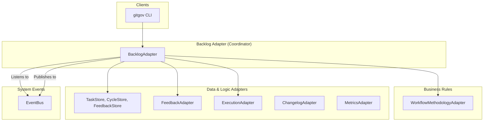

# Design Document

## Overview

The BacklogAdapter is the central **orchestrator** for task and cycle lifecycle management. It acts as a **Facade/Mediator** that coordinates between data protocols (`Task`, `Cycle`) and business rule protocols (`WorkflowMethodology`).

Crucially, this adapter is **stateless and contains no business logic itself**. Its sole purpose is to orchestrate other, specialized components.

## Architecture: The Great Orchestrator

The BacklogAdapter sits at the heart of the system, acting as a central hub that connects data, business rules, and system events.



### Core Flows

- **Public API Call (e.g., `submitTask`)**: The adapter receives the call, builds a `ValidationContext`, and delegates the validation logic to the `WorkflowMethodologyAdapter`. If validation passes, it updates the record and emits a `task.status.changed` event.
- **Event Handler (e.g., `handleFeedbackCreated`)**: The adapter listens for events on the `EventBus`. When a `feedback.created` event of type `blocking` occurs, the handler pauses the associated task and emits a new `task.status.changed` event.

## Components and Interfaces

### Core Interface (`IBacklogAdapter`)

```typescript
interface IBacklogAdapter {
  // Task Lifecycle
  createTask(
    payload: Partial<TaskRecord>,
    actorId: string
  ): Promise<TaskRecord>;
  submitTask(taskId: string, actorId: string): Promise<TaskRecord>;
  approveTask(taskId: string, actorId: string): Promise<TaskRecord>;

  // Cycle Lifecycle
  createCycle(
    payload: Partial<CycleRecord>,
    actorId: string
  ): Promise<CycleRecord>;
  addTaskToCycle(cycleId: string, taskId: string): Promise<void>;

  // Queries & Health
  getTasksAssignedToActor(actorId: string): Promise<TaskRecord[]>;
  getSystemStatus(): Promise<SystemStatus>;
  getTaskHealth(taskId: string): Promise<TaskHealthReport>;

  // Read-only queries are omitted for brevity (getTask, getAllTasks, etc.)
}
```

### Event Handlers

The adapter contains private methods that are subscribed to the `EventBus` to handle the reactive logic of the system:

- `handleFeedbackCreated`
- `handleFeedbackResolved`
- `handleExecutionCreated`
- `handleChangelogCreated`
- `handleDailyTick`

## Data Models

The adapter uses the canonical `TaskRecord` and `CycleRecord` as its primary data models, orchestrating their state transitions based on events and methodology rules.

## Error Handling

- **`ProtocolViolationError`**: Thrown when an action is rejected by the `WorkflowMethodology` (e.g., illegal state transition, invalid signature).
- **`RecordNotFoundError`**: Thrown for operations on non-existent tasks or cycles.
- Errors from depended-on adapters are caught and re-thrown with additional context.
