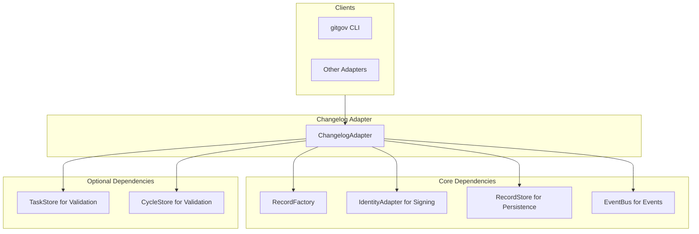

# Design Document

## Overview

The ChangelogAdapter serves as the **enterprise historian** of the GitGovernance system. It manages `ChangelogRecords` that document significant changes across any entity type (tasks, cycles, agents, etc.) with complete context, conditional validation, and cross-entity traceability.

It follows the Facade + Dependency Injection pattern to orchestrate multiple system protocols in a testable manner.

## Architecture



### Dependency Architecture

- **Required**: `ChangelogStore`, `IdentityAdapter`, `EventBus`.
- **Optional**: `TaskStore`, `CycleStore` for entity existence validation. This allows for **graceful degradation**.

## Components and Interfaces

### Core Interface (`IChangelogAdapter`)

```typescript
interface IChangelogAdapter {
  create(
    payload: Partial<ChangelogRecord>,
    actorId: string
  ): Promise<ChangelogRecord>;
  getChangelog(changelogId: string): Promise<ChangelogRecord | null>;
  getChangelogsByEntity(
    entityId: string,
    entityType?: string
  ): Promise<ChangelogRecord[]>;
  getAllChangelogs(): Promise<ChangelogRecord[]>;
  getRecentChangelogs(limit: number): Promise<ChangelogRecord[]>;
}
```

### Key Method: `create()`

The `create` method is the core of the adapter. Its processing flow is:

1.  **Validate Payload**: Check for required fields and conditional rules (e.g., `rollbackInstructions` for high-risk changes).
2.  **Validate Entity (Optional)**: If entity stores are provided, check if the target entity exists.
3.  **Build & Sign**: Use the factory to build the record and the `IdentityAdapter` to sign it.
4.  **Persist**: Save the record using the `ChangelogStore`.
5.  **Emit Event**: Publish a `changelog.created` event to the `EventBus`.

## Data Models

The adapter uses the canonical `ChangelogRecord` which has 11 required fields and 8 optional fields, including complex conditional validation based on `riskLevel` and `changeType`. This structure allows it to function as an enterprise-grade historian.

## Data Models

The adapter uses the canonical `ChangelogRecord` which has 11 required fields and 8 optional fields, including complex conditional validation based on `riskLevel` and `changeType`. This structure allows it to function as an enterprise-grade historian.

### ChangelogRecord Structure

```typescript
interface ChangelogRecord {
  // Required fields (11)
  id: string;
  entityId: string;
  entityType: string;
  changeType: string;
  title: string;
  description: string;
  actorId: string;
  timestamp: number;
  riskLevel: 'low' | 'medium' | 'high' | 'critical';
  
  // Optional fields (8) with conditional validation
  rollbackInstructions?: string; // Required for high/critical risk
  references?: {
    tasks?: string[]; // Required for 'completion' changeType
    cycles?: string[];
    related?: string[];
  };
  metadata?: Record<string, any>;
  tags?: string[];
}
```

## Error Handling

- **`DetailedValidationError`**: Thrown for any schema or conditional validation failures.
- **`RecordNotFoundError`**: Thrown only if an optional entity store is provided and the target entity does not exist.
- **`SignatureVerificationError`**: Thrown when cryptographic signature verification fails.
- **`ActorNotFoundError`**: Thrown when the signing actor's key cannot be found.

## Testing Strategy

### Unit Testing Approach

- **Validation Testing**: Test all conditional validation rules (risk level, change type requirements)
- **Integration Testing**: Test with both required and optional dependencies
- **Error Path Testing**: Verify all error conditions throw appropriate exceptions
- **Performance Testing**: Ensure operations complete within 40ms target
- **Cryptographic Testing**: Verify signing and verification processes

### Test Coverage Requirements

- 100% coverage for core business logic
- All 16 EARS requirements mapped to specific tests
- Mock external dependencies for isolated testing
- Test graceful degradation when optional stores are unavailable
