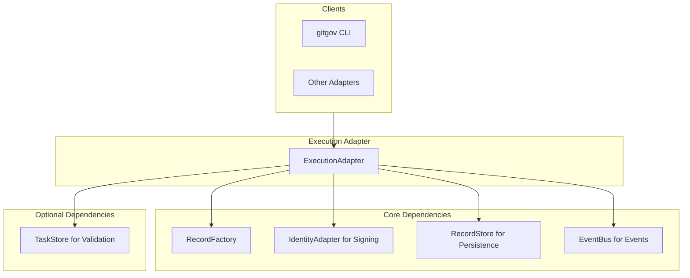

# Design Document

## Overview

The Execution Adapter serves as the **"chronicler"** of the GitGovernance system. It provides a unified public facade for managing `ExecutionRecord` operations and implements the business rules defined in `execution_protocol.md`.

Its core responsibilities are to create immutable audit logs of work performed and to emit `execution.created` events for system-wide coordination.

## Architecture



### Dependency Architecture

- **Required**: `ExecutionStore`, `IdentityAdapter`, `EventBus`.
- **Optional**: `TaskStore` for validating the existence of `taskId`. This enables **graceful degradation**.

## Components and Interfaces

### Core Interface (`IExecutionAdapter`)

```typescript
interface IExecutionAdapter {
  create(
    payload: Partial<ExecutionRecord>,
    actorId: string
  ): Promise<ExecutionRecord>;
  getExecution(executionId: string): Promise<ExecutionRecord | null>;
  getExecutionsByTask(taskId: string): Promise<ExecutionRecord[]>;
  getAllExecutions(): Promise<ExecutionRecord[]>;
}
```

### Key Method: `create()`

The `create` method is the adapter's core function. Its processing flow is:

1.  **Validate Payload**: Check for required fields (e.g., `result`, `taskId`).
2.  **Validate Task (Optional)**: If `taskStore` is provided, check if the target `taskId` exists.
3.  **Build & Sign**: Use the factory to build the record and the `IdentityAdapter` to sign it.
4.  **Persist**: Save the record using the `ExecutionStore`.
5.  **Emit Event**: Publish an `execution.created` event to the `EventBus`.

## Data Models

The adapter uses the canonical `ExecutionRecord` which has 3 required fields (`id`, `taskId`, `result`) and 4 optional fields. It is wrapped in the standard `GitGovRecord` structure.

## Error Handling

- **`DetailedValidationError`**: Thrown for any schema validation failures (e.g., missing `result`).
- **`RecordNotFoundError`**: Thrown only if `taskStore` is provided and the `taskId` does not exist.

## Testing Strategy

The adapter will be tested with comprehensive unit tests covering:

- **Success Paths**: Valid record creation, retrieval, and querying operations
- **Error Paths**: Invalid payloads, missing tasks, and validation failures
- **Integration**: EventBus emission and store persistence
- **Performance**: Operations completing within 30ms for typical datasets
- **Security**: Cryptographic signing and verification of records

All tests will map to specific EARS requirements from the requirements document to ensure complete coverage.
