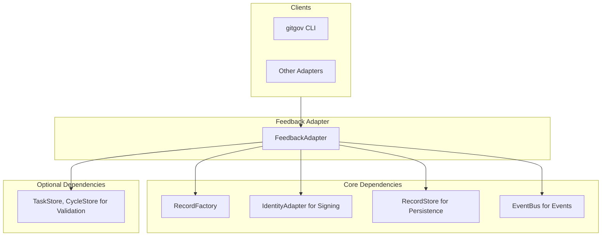

# Design Document

## Overview

The FeedbackAdapter is the **communication facilitator** of the GitGovernance system. It manages `FeedbackRecords` to enable structured communication like assignments, questions, and blockers.

It follows the Facade + Dependency Injection pattern and emits a dual event stream (`feedback.created`, `feedback.status.changed`) for system-wide coordination.

## Architecture



### Dependency Architecture

- **Required**: `FeedbackStore`, `IdentityAdapter`, `EventBus`.
- **Optional**: `TaskStore`, `CycleStore` for entity validation, enabling **graceful degradation**.

## Components and Interfaces

### Core Interface (`IFeedbackAdapter`)

```typescript
interface IFeedbackAdapter {
  create(
    payload: Partial<FeedbackRecord>,
    actorId: string
  ): Promise<FeedbackRecord>;
  resolve(feedbackId: string, actorId: string): Promise<FeedbackRecord>;
  getFeedback(feedbackId: string): Promise<FeedbackRecord | null>;
  getFeedbackByEntity(entityId: string): Promise<FeedbackRecord[]>;
  getAllFeedback(): Promise<FeedbackRecord[]>;
}
```

### Key Methods

- **`create()`**: The core creation method. It validates the payload, builds and signs the record, persists it, and emits a `feedback.created` event.
- **`resolve()`**: Transitions a feedback record's status to `resolved`, adds a new signature from the resolver, persists the change, and emits a `feedback.status.changed` event.

## Data Models

The adapter uses the canonical `FeedbackRecord`, which has 6 required fields (`id`, `entityType`, `entityId`, `type`, `status`, `content`) and 2 optional fields. It is wrapped in the standard `GitGovRecord` structure.

## Error Handling

- **`DetailedValidationError`**: Thrown for schema validation failures during record creation or updates.
- **`RecordNotFoundError`**: Thrown when attempting to access non-existent feedback records or entities.
- **`ProtocolViolationError`**: Thrown for invalid state transitions, such as resolving an already-resolved feedback or attempting operations on invalid record states.

## Testing Strategy

### Unit Testing
- Test all public methods with valid and invalid inputs
- Verify proper error handling for all error conditions
- Mock dependencies (`RecordStore`, `EventBus`, `IdentityAdapter`) for isolated testing
- Test graceful degradation when optional dependencies are unavailable

### Integration Testing
- Test event emission and subscription patterns
- Verify cryptographic signing and verification workflows
- Test cross-adapter communication via EventBus
- Validate persistence layer integration with RecordStore

### Performance Testing
- Ensure all operations complete within 50ms for typical datasets
- Test with large numbers of feedback records
- Verify memory usage remains reasonable during bulk operations
