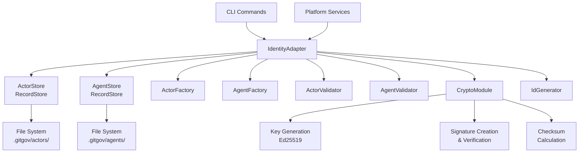
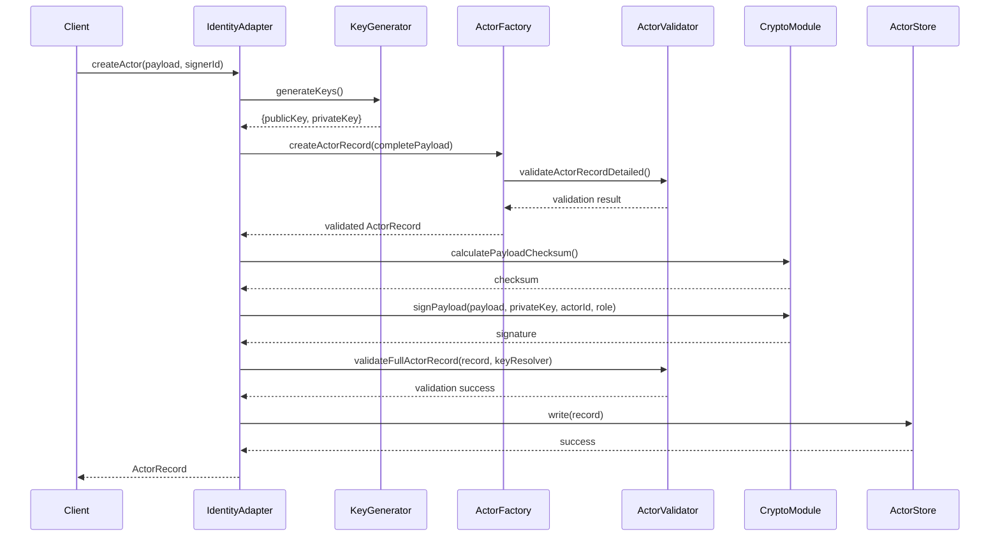
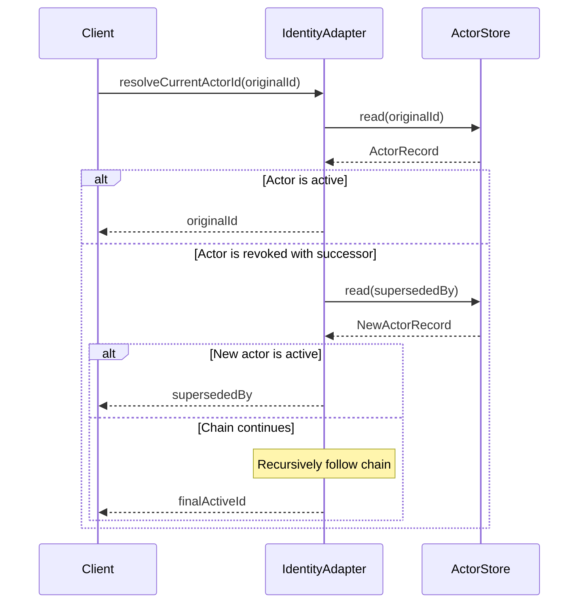

# Design Document

## Overview

The Identity Adapter serves as the orchestration layer for the Identity Domain within the GitGovernance system. It provides a unified public facade for managing `ActorRecord` and `AgentRecord` operations while coordinating between specialized modules (crypto, factory, validator, and store). The adapter implements the canonical representation of business rules defined in `actor_protocol.md` and `agent_protocol.md`.

The adapter follows key architectural principles:

- **Domain Orchestration**: Coordinates crypto, factory, validator, and store modules
- **Stateless Operation**: Pure methods or state management through RecordStore
- **Separation of Responsibilities**: Handles business logic while delegating specific operations to specialized modules
- **Protocol Compliance**: Implements all rules from actor and agent protocols

## Architecture

### High-Level Architecture



### Module Dependencies

The Identity Adapter orchestrates the following core modules:

1. **RecordStore**: Handles persistence to `.gitgov/actors/` and `.gitgov/agents/`
2. **Factories**: Create validated record structures with proper defaults
3. **Validators**: Ensure schema compliance and business rule validation using AJV with JSON schemas
4. **Crypto Module**: Manages Ed25519 key generation, signing, and verification
5. **ID Generator**: Creates human-readable, hierarchical actor IDs
6. **EventBus Module**: Enables decoupled inter-adapter communication
7. **Config Manager**: Manages session state and local configuration

## Components and Interfaces

### Core Class Structure

```typescript
export class IdentityAdapter {
  private actorStore: RecordStore<ActorRecord>;
  private agentStore: RecordStore<AgentRecord>;
  private eventBus?: IEventStream;
  private configManager: ConfigManager;

  constructor(
    rootPath?: string,
    eventBus?: IEventStream,
    configManager?: ConfigManager
  );

  // Actor Operations
  async createActor(
    payload: ActorPayload,
    signerId: string
  ): Promise<ActorRecord>;
  async getActor(actorId: string): Promise<ActorRecord | null>;
  async listActors(): Promise<ActorRecord[]>;
  async revokeActor(actorId: string): Promise<ActorRecord>;

  // Succession Chain Resolution
  async resolveCurrentActorId(originalActorId: string): Promise<string>;
  async getEffectiveActorForAgent(agentId: string): Promise<ActorRecord | null>;
  async getCurrentActor(): Promise<ActorRecord>;

  // Agent Operations
  async createAgentRecord(payload: Partial<AgentPayload>): Promise<AgentRecord>;
  async getAgentRecord(agentId: string): Promise<AgentRecord | null>;
  async listAgentRecords(): Promise<AgentRecord[]>;

  // Future Operations (Placeholder)
  async signRecord(
    record: GitGovRecord,
    actorId: string,
    role: string
  ): Promise<GitGovRecord>;
  async rotateActorKey(
    actorId: string
  ): Promise<{ oldActor: ActorRecord; newActor: ActorRecord }>;
  async authenticate(sessionToken: string): Promise<void>;
}
```

### Event-Driven Integration

The Identity Adapter is a primary event emitter within the GitGovernance ecosystem, enabling decoupled communication between different domains. It emits events when key lifecycle actions occur.

**Emitted Events:**

- `identity.actor.created`: Fired when a new actor is successfully created. Includes actor ID, type, and whether it's the bootstrap actor.
- `identity.actor.revoked`: Fired when an actor's status is changed to 'revoked'. Includes details on who revoked it and why.
- `identity.agent.registered`: Fired when a new agent manifest is created. Includes the agent's guild and engine configuration.

**Event Types:**

```typescript
interface ActorCreatedEvent {
  type: 'identity.actor.created';
  payload: {
    actorId: string;
    actorType: 'human' | 'agent';
    isBootstrap: boolean;
    timestamp: number;
  };
}

interface ActorRevokedEvent {
  type: 'identity.actor.revoked';
  payload: {
    actorId: string;
    revokedBy: string;
    supersededBy?: string;
    timestamp: number;
  };
}

interface AgentRegisteredEvent {
  type: 'identity.agent.registered';
  payload: {
    agentId: string;
    guild: string;
    engine: AgentEngine;
    timestamp: number;
  };
}
```

This integration is designed with **graceful degradation**: if no event bus is provided to the adapter's constructor, it will still function correctly but without emitting events.

### Data Flow Patterns

#### Actor Creation Flow



#### Succession Chain Resolution Flow



## Data Models

### ActorRecord Structure

Based on `actor_protocol.md`, the ActorRecord follows this canonical structure:

```typescript
interface ActorRecord {
  id: string; // Format: [type]:[name]:[scope]...
  type: "human" | "agent"; // Actor classification
  displayName: string; // Human-readable name (1-100 chars)
  publicKey: string; // Ed25519 public key (base64)
  roles: [string, ...string[]]; // Capacity roles (min 1, unique)
  status?: "active" | "revoked"; // Lifecycle status (default: active)
  supersededBy?: string; // ID of replacement actor
  metadata?: Record<string, unknown>; // Extensible metadata
}
```

### AgentRecord Structure

Based on `agent_protocol.md`, the AgentRecord defines operational manifests:

```typescript
interface AgentRecord {
  id: string; // Must match existing ActorRecord of type 'agent'
  guild: "design" | "intelligence" | "strategy" | "operations" | "quality";
  engine: LocalEngine | ApiEngine | McpEngine;
  status?: "active" | "archived"; // Default: active
  triggers?: TriggerConfig[];
  knowledge_dependencies?: string[];
  prompt_engine_requirements?: PromptEngineConfig;
}
```

### GitGovRecord Wrapper

All records are wrapped in the standard GitGovernance structure:

```typescript
interface GitGovRecord {
  header: {
    version: string; // "1.0"
    type: string; // "actor" | "agent"
    payloadChecksum: string; // SHA-256 of payload
    signatures: Signature[]; // Array of cryptographic signatures
  };
  payload: ActorRecord | AgentRecord;
}
```

## Error Handling

### Validation Errors

- **Schema Validation**: Use DetailedValidationError for comprehensive field-level feedback
- **Business Rule Violations**: Throw specific errors for protocol violations
- **Missing Dependencies**: Clear error messages for missing ActorRecords when creating AgentRecords

### Cryptographic Errors

- **Key Generation Failures**: Propagate crypto module errors with context
- **Signature Verification**: Return false for invalid signatures, log warnings
- **Checksum Mismatches**: Throw errors for corrupted records

### Storage Errors

- **File System Issues**: Handle ENOENT gracefully, propagate other errors
- **Concurrency**: RecordStore handles atomic writes, adapter ensures consistency
- **Corruption**: Validate records on read, throw errors for invalid JSON

### Error Response Patterns

```typescript
// Validation errors with detailed feedback
throw new DetailedValidationError("ActorRecord", validation.errors);

// Business rule violations
throw new Error(
  'ActorRecord with id ${id} must be of type "agent" to create AgentRecord'
);

// Missing dependencies
throw new Error(
  "ActorRecord with id ${id} not found. AgentRecord can only be created for existing ActorRecord"
);

// Future operations
throw new Error(
  "signRecord requires private key access - not available in core module"
);
```

## Testing Strategy

### Unit Testing Approach

The existing test suite demonstrates comprehensive mocking patterns:

1. **Mock All Dependencies**: RecordStore, factories, validators, crypto modules
2. **Test Each Operation Independently**: Isolate business logic from infrastructure
3. **Validate EARS Requirements**: Each test maps to specific acceptance criteria
4. **Error Path Coverage**: Test all validation and error scenarios

### Test Categories

#### Actor Operations Testing

- ✅ Actor creation with key generation
- ✅ Actor retrieval (existing and non-existent)
- ✅ Actor listing (populated and empty)
- ✅ Actor revocation
- ✅ Succession chain resolution (single and multi-hop)
- ✅ Validation error handling

#### Agent Operations Testing

- ✅ Agent creation with ActorRecord validation
- ✅ Agent retrieval and listing
- ✅ Error handling for missing/invalid ActorRecords
- ✅ Type validation (agent vs human ActorRecords)

#### Integration Testing

- **File System Integration**: Test actual RecordStore operations
- **Crypto Integration**: Test real key generation and signing
- **End-to-End Workflows**: Complete actor/agent lifecycle scenarios

### Test Data Patterns

```typescript
const sampleActorPayload: ActorRecord = {
  id: "human:test-user",
  type: "human",
  displayName: "Test User",
  publicKey: "sample-public-key",
  roles: ["author"],
  status: "active",
};

const sampleAgentPayload: AgentRecord = {
  id: "agent:test-agent",
  guild: "design",
  status: "active",
  engine: {
    type: "local",
    runtime: "typescript",
    entrypoint: "test.ts",
    function: "run",
  },
};
```

## Implementation Notes

### Key Design Decisions

1. **Separation of Concerns**: Actor identity vs Agent functionality - clear domain boundaries
2. **Immutable Records**: Follow protocol requirements for immutability with cryptographic signatures
3. **Succession Chain Resolution**: Automatic resolution maintains operational continuity during key rotation
4. **Private Key Management**: Explicitly excluded from core module for security - managed externally
5. **Bootstrap Trust**: First actor serves as root of trust for the entire system
6. **Event-Driven Architecture**: Use EventBus for decoupled inter-adapter communication
7. **Dependency Injection**: Constructor injection for testability and flexibility
8. **Graceful Degradation**: Adapter functions without optional dependencies like EventBus

### Security Considerations

1. **Private Key Isolation**: Private keys never stored in core, managed externally
2. **Signature Verification**: All records must be cryptographically signed
3. **Chain of Trust**: New actors must be signed by existing authorized actors
4. **Audit Trail**: Immutable succession chains provide complete audit history

### Performance Considerations

1. **Lazy Loading**: Records loaded on-demand from file system
2. **Caching Strategy**: RecordStore handles file system caching
3. **Succession Resolution**: Efficient chain traversal with early termination
4. **Batch Operations**: List operations optimize file system access

### Future Enhancements

1. **Private Key Integration**: External key management system integration
2. **Advanced Authentication**: Session token management for SaaS mode
3. **Key Rotation Workflows**: Complete implementation of actor key rotation
4. **Performance Optimization**: In-memory caching for frequently accessed records
