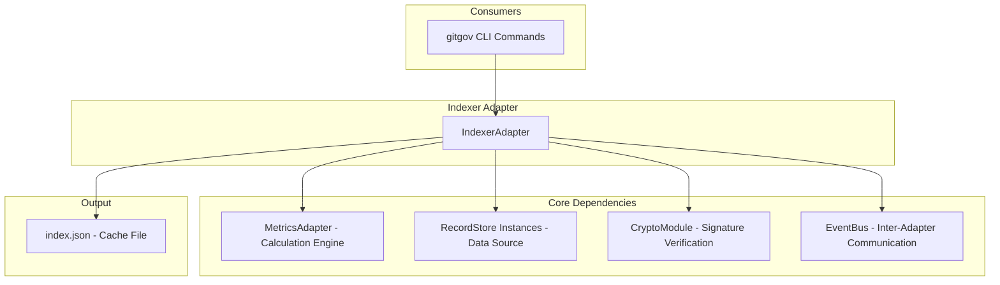

# Design Document

## Overview

The IndexerAdapter is the **local cache and performance optimization engine** for GitGovernance. Its purpose is to transform distributed, raw `Record` data into an aggregated, optimized view (`index.json`) for fast CLI queries. It converts O(n) file system scans into O(1) lookups for commands like `gitgov status` and `gitgov task list`.

The adapter is a read-only system that **never acts as a source of truth**; its cache is entirely regenerable. It follows key architectural principles:

- **Performance-First**: Drastically accelerates CLI read operations.
- **Metrics-Driven**: Uses `MetricsAdapter` as its core calculation engine.
- **Intelligent Enrichment**: Calculates "derived states" to add actionable insights to raw data.
- **Graceful Degradation**: The CLI remains functional (though slower) if the cache is unavailable.

## Architecture



### Core Flows

1.  **Generation (`generateIndex`)**: The adapter reads all records from all RecordStore instances, validates cryptographic signatures using CryptoModule, passes them to the `MetricsAdapter` for mathematical calculations, computes its own derived states (e.g., `isStalled`), and writes the combined, enriched data to `index.json`.
2.  **Consumption (`getIndexData`)**: CLI commands call this method, which reads the pre-computed `index.json` file, ensuring a near-instantaneous response. It first checks if the index is up-to-date.
3.  **Event Handling**: The adapter subscribes to relevant domain events via EventBus to trigger cache invalidation when records are modified.

## Components and Interfaces

### Core Interface (`IIndexerAdapter`)

```typescript
interface IIndexerAdapter {
  generateIndex(): Promise<IndexGenerationReport>;
  getIndexData(): Promise<IndexData | null>;
  validateIntegrity(): Promise<IntegrityReport>;
  isIndexUpToDate(): Promise<boolean>;
  invalidateCache(): Promise<void>;
}
```

### Key Components

- **Index Generator**: Orchestrates the multi-store read, calculation, and cache-writing process.
- **Cache Reader**: Provides fast, read-only access to the `index.json` file.
- **Integrity Validator**: Scans all raw records to verify JSON schemas, SHA-256 checksums, and Ed25519 signatures using CryptoModule.
- **Derived State Calculator**: Applies business logic to identify tasks that are stalled, at-risk, or blocked.
- **Freshness Checker**: Compares cache timestamps and Git HEAD to determine if the index is stale.

## Data Models

The adapter consumes all canonical `Record` types and produces a single, rich data object:

### Core Data Structures

```typescript
interface IndexData {
  metadata: {
    generatedAt: number;
    gitHeadHash: string;
    recordCounts: Record<string, number>;
    generationTimeMs: number;
  };
  enrichedRecords: {
    tasks: EnrichedTaskRecord[];
    actors: ActorRecord[];
    executions: ExecutionRecord[];
    cycles: CycleRecord[];
    feedback: FeedbackRecord[];
    changelog: ChangelogRecord[];
  };
  aggregatedMetrics: MetricsSnapshot;
  derivedStates: DerivedStateMap;
}

interface EnrichedTaskRecord extends TaskRecord {
  derivedState: {
    isStalled: boolean;
    isAtRisk: boolean;
    needsClarification: boolean;
    isBlocked: boolean;
    healthScore: number;
    daysSinceLastActivity: number;
  };
}

interface IndexGenerationReport {
  success: boolean;
  recordsProcessed: number;
  metricsCalculated: number;
  cacheSizeBytes: number;
  generationTimeMs: number;
  errors: string[];
  warnings: string[];
}

interface IntegrityReport {
  totalRecords: number;
  validRecords: number;
  invalidSchemas: string[];
  invalidChecksums: string[];
  invalidSignatures: string[];
  cacheConsistency: boolean;
}
```

## Error Handling

The IndexerAdapter follows our standard error handling patterns:

### Exception Types

```typescript
class IndexGenerationError extends Error {
  constructor(message: string, public cause?: Error) {
    super(message);
    this.name = 'IndexGenerationError';
  }
}

class CacheCorruptionError extends Error {
  constructor(message: string, public filePath: string) {
    super(message);
    this.name = 'CacheCorruptionError';
  }
}

class IntegrityValidationError extends Error {
  constructor(message: string, public violations: string[]) {
    super(message);
    this.name = 'IntegrityValidationError';
  }
}
```

### Error Handling Strategy

- **Resilience First**: If cache generation fails, preserve the previous cache and return detailed error reports
- **Graceful Degradation**: If cache is corrupt or missing, `getIndexData` returns `null`, signaling CLI to fall back to direct RecordStore reads
- **Detailed Reporting**: All operations return comprehensive reports with specific error messages and context
- **Automatic Recovery**: Cache corruption triggers automatic regeneration on next CLI command

## Testing Strategy

### Unit Testing Approach

- **Dependency Injection**: Mock all dependencies (MetricsAdapter, RecordStore instances, CryptoModule) for isolated testing
- **EARS Mapping**: Each test maps to specific acceptance criteria from requirements
- **Performance Validation**: Verify generation times meet phase-specific targets (<1s for Phase 1)
- **Error Scenarios**: Test all failure modes including corrupt cache, missing dependencies, and invalid records

### Integration Testing

- **End-to-End Flows**: Test complete generation → consumption → validation cycles
- **Cross-Adapter Communication**: Verify EventBus integration for cache invalidation
- **File System Operations**: Test actual cache file creation, reading, and cleanup
- **Cryptographic Verification**: Test signature validation with real Ed25519 keys

### Performance Testing

- **Scalability Validation**: Test with datasets of varying sizes (100, 500, 5000+ records)
- **Memory Usage**: Monitor memory consumption during large dataset processing
- **Cache Hit Performance**: Verify <10ms response times for cached queries
- **Degradation Performance**: Measure fallback performance when cache unavailable
