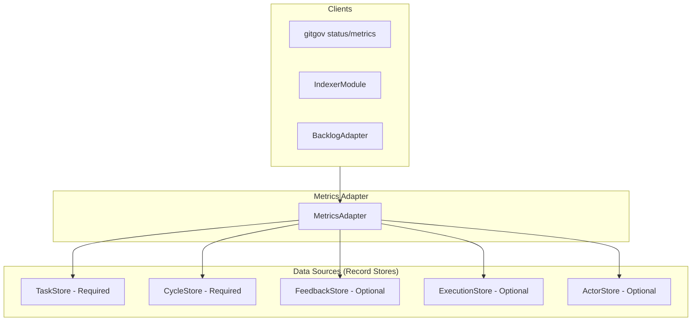

# Design Document

## Overview

The MetricsAdapter is the **pure calculation engine** of the GitGovernance system. It transforms raw `Record` data into quantifiable metrics and insights. It is architected as a stateless service with pure functions, ensuring that calculations are predictable and have no side effects.

Its key architectural principles are:

- **Pure Calculation Engine**: All methods are pure functions.
- **Stateless Operations**: No internal state is maintained.
- **Read-Only**: The adapter only reads data, never modifies it.
- **Graceful Degradation**: Core metrics function even if optional data stores are missing.

## Architecture



### Tiered Calculation Model

The adapter implements a tiered system, allowing for progressive implementation and clear separation of concerns.

- **Tier 1 (MVP)**: Core health and status metrics.
- **Tier 2 (Productivity)**: Team performance metrics like `throughput` and `cycleTime`.
- **Tier 3 & 4 (Future)**: Advanced analytics and premium, platform-dependent metrics.

## Components and Interfaces

### Core Interface (`IMetricsAdapter`)

The public API provides high-level metric objects, while the core logic resides in granular, pure calculation functions.

```typescript
interface IMetricsAdapter {
  // Public API Methods
  getSystemStatus(): Promise<SystemStatus>;
  getTaskHealth(taskId: string): Promise<TaskHealthReport>;
  getProductivityMetrics(): Promise<ProductivityMetrics>;
  getCollaborationMetrics(): Promise<CollaborationMetrics>;

  // Pure Calculation Functions (examples)
  calculateHealth(tasks: TaskRecord[]): number;
  calculateLeadTime(tasks: TaskRecord[]): number;
  calculateActiveAgents(
    actors: ActorRecord[],
    executions: ExecutionRecord[]
  ): number;
}
```

## Data Models

The adapter consumes all canonical `Record` types and produces specific data models for reporting.

- **`SystemStatus`**: Aggregated overview of the project's health and backlog distribution.
- **`TaskHealthReport`**: Detailed analysis of a single task's health, including staleness and blockers.
- **`ProductivityMetrics`**: Team performance indicators like throughput and cycle time.
- **`CollaborationMetrics`**: Metrics related to AI agent activity and utilization.

## Error Handling

- **`RecordNotFoundError`**: Thrown if a specific record (e.g., a task for `getTaskHealth`) is not found.
- **`InvalidDataError`**: Thrown by pure functions if the input data is corrupt or invalid.
- **Graceful Degradation**: For mathematical edge cases (like division by zero) or missing optional stores, the adapter returns `0` or default values instead of throwing an error.
