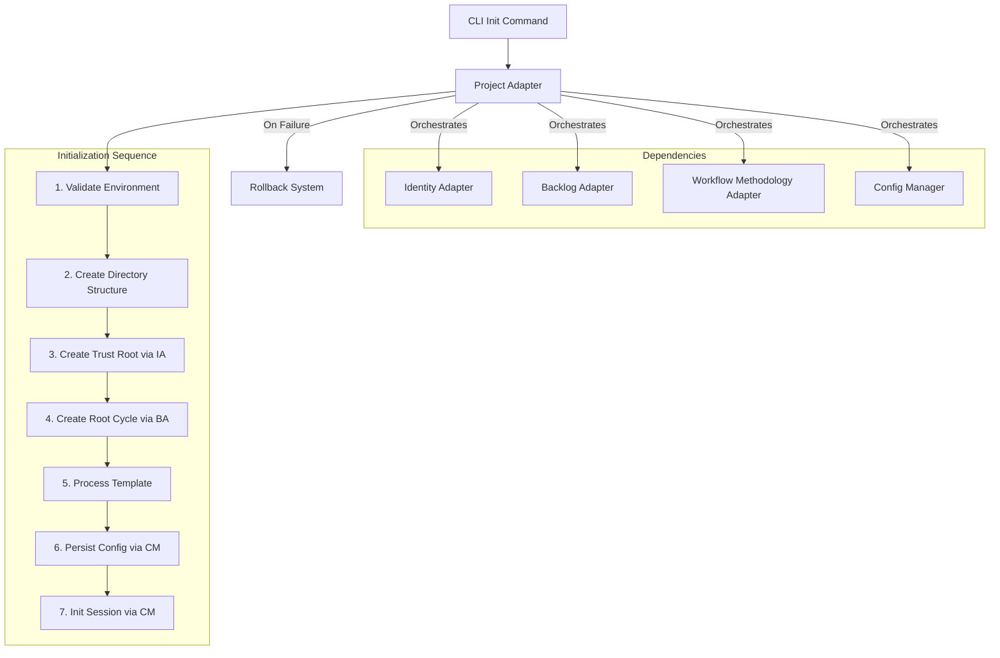

# Design Document

## Overview

The Project Adapter serves as the **project initialization engine** and **orchestration facade** for the GitGovernance ecosystem. It implements a multi-pattern architecture, primarily the **Facade Pattern**, to coordinate project bootstrap operations across multiple core adapters while maintaining a clean separation of concerns.

It acts as the single entry point for the project lifecycle, orchestrating complex interactions between identity management (`IdentityAdapter`), backlog creation (`BacklogAdapter`), workflow setup (`WorkflowMethodologyAdapter`), and configuration persistence (`ConfigManager`).

## Architecture

### System Integration and Orchestration

The adapter's primary role is to mediate communication and orchestrate a sequence of operations between other specialized components.



### Dependency Injection

All dependencies are injected via a constructor, enabling testability and graceful degradation for optional (future) platform features.

```typescript
export interface ProjectAdapterDependencies {
  // Core Adapters (Required)
  identityAdapter: IIdentityAdapter;
  backlogAdapter: IBacklogAdapter;
  workflowMethodologyAdapter: IWorkflowMethodologyAdapter;

  // Infrastructure Layer (Required)
  configManager: IConfigManager;
  taskStore: IRecordStore<TaskRecord>;
  cycleStore: IRecordStore<CycleRecord>;

  // Optional Platform Features (Future)
  eventBus?: IEventStream;
}
```

## Components and Interfaces

### Primary Interface (IProjectAdapter)

```typescript
export interface IProjectAdapter {
  // Core Bootstrap Operations
  initializeProject(options: ProjectInitOptions): Promise<ProjectInitResult>;
  validateEnvironment(path?: string): Promise<EnvironmentValidation>;
  processBlueprintTemplate(
    templatePath: string,
    context: ProjectContext
  ): Promise<TemplateProcessingResult>;

  // Future Platform Operations
  getProjectInfo(): Promise<ProjectInfo | null>;
  updateProjectConfig(updates: Partial<GitGovConfig>): Promise<void>;
  generateProjectReport(): Promise<ProjectReport>;
}
```

### Key Orchestration Flows

#### `initializeProject`

This method executes the main orchestration sequence, calling other adapters and services in the correct order to bootstrap the project. It wraps the entire process in error handling to trigger a rollback if any step fails.

#### `validateEnvironment`

This is a pre-flight check that uses `ConfigManager` and file system utilities to ensure the target directory is a valid and clean location for a new project.

#### `processBlueprintTemplate`

This flow reads a JSON template, validates it, and then orchestrates the `BacklogAdapter` to create the cycles and tasks defined within it.

## Data Models

The adapter uses data models defined elsewhere in the system. Its specific input and output types are:

### Input Models

```typescript
export type ProjectInitOptions = {
  name: string;
  template?: string;
  actorName?: string;
  methodology?: "default" | "scrum";
};
```

### Output Models

```typescript
export type ProjectInitResult = {
  success: boolean;
  projectId: string;
  rootCycle: string;
  actor: { id: string; displayName: string };
  template?: { cyclesCreated: number; tasksCreated: number };
};

export type EnvironmentValidation = {
  isValid: boolean;
  warnings: string[];
  suggestions: string[];
};
```

## Error Handling

The adapter relies on the standard error hierarchy (`DetailedValidationError`, `ProjectRootError`). Its main responsibility is to catch errors thrown by the adapters it orchestrates and trigger the `rollbackPartialSetup` flow to ensure a clean state.
