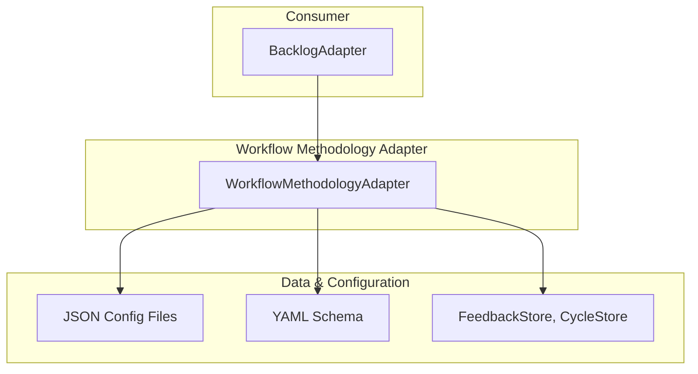

# Design Document

## Overview

The WorkflowMethodologyAdapter is a **configurable rules engine** that decouples the `BacklogAdapter` from specific business rules. It acts as a "governance oracle," validating state transitions, signatures, and custom rules based on schema-driven JSON configurations.

Its key architectural principles are:

- **Configuration-Driven**: Business logic is defined in external JSON files.
- **Guild-Based Validation**: Signature rules can vary by task `guild` tags.
- **Extensible Rules Engine**: Supports custom validation logic for organization-specific policies.
- **Performance-First**: Sub-50ms validation for real-time workflow operations.

## Architecture



### Validation Flow

The `BacklogAdapter` delegates all governance decisions to this adapter.

1.  `BacklogAdapter` initiates an action (e.g., `approveTask`).
2.  It calls a method on `WorkflowMethodologyAdapter` (e.g., `validateSignature`) with the full context (task, actor, etc.).
3.  `WorkflowMethodologyAdapter` loads the active JSON configuration, finds the relevant rule, and performs the validation.
4.  It returns a boolean verdict to the `BacklogAdapter`, which then proceeds or throws an error.

## Components and Interfaces

### Core Interface (`IWorkflowMethodology`)

```typescript
interface IWorkflowMethodology {
  getTransitionRule(
    from: TaskStatus,
    to: TaskStatus,
    context: ValidationContext
  ): Promise<TransitionRule | null>;
  validateSignature(
    signature: Signature,
    context: ValidationContext
  ): Promise<boolean>;
  validateCustomRules(
    rules: string[],
    context: ValidationContext
  ): Promise<boolean>;
  getViewConfig(viewName: string): ViewConfig | null;
  reloadConfig(): Promise<void>;
}
```

### Key Components

- **Configuration Loader**: Reads and caches validated methodology JSON files.
- **Transition Validator**: Checks if a state change is permitted by the `state_transitions` rules.
- **Signature Validator**: Checks a signature against `signatures` rules, considering the task's `guild`.
- **Custom Rules Engine**: Executes custom logic like `assignment_required`.
- **View Config Provider**: Returns UI column mappings from `view_configs`.

## Data Models

### Core Configuration Structure

```typescript
interface WorkflowMethodologyConfig {
  state_transitions: StateTransitionRules;
  signatures: SignatureRules;
  custom_rules: CustomRuleDefinitions;
  view_configs: ViewConfigMappings;
}

interface ValidationContext {
  task: TaskRecord;
  actor: ActorRecord;
  targetStatus?: TaskStatus;
  guild?: string;
}
```

The adapter is configured by a `WorkflowMethodologyConfig` object, which is loaded from a JSON file and validated against the canonical `workflow_methodology_schema.yaml`. This configuration defines:

- **`state_transitions`**: Rules governing valid status changes
- **`signatures`**: Guild-specific signature requirements  
- **`custom_rules`**: Extensible validation logic definitions
- **`view_configs`**: UI column-to-status mappings

### Performance Considerations

- Configuration is cached in memory after initial load
- Schema validation occurs only during config load/reload
- All validation operations target <50ms execution time
- Optional store dependencies degrade gracefully when unavailable

## Error Handling

The adapter implements comprehensive error handling with specific exception types:

- **`DetailedValidationError`**: Thrown for invalid configuration files that don't match the schema, includes field-level validation details
- **`ProtocolViolationError`**: Thrown when a business rule is violated (e.g., illegal state transition or invalid signature)
- **`UnknownRuleError`**: Thrown if the configuration references a custom rule that is not implemented
- **Graceful Degradation**: Missing optional dependencies (FeedbackStore, CycleStore) are handled without failure

## Testing Strategy

The adapter will be validated through comprehensive testing covering:

- **Configuration Validation**: Schema compliance for both valid and invalid configurations
- **State Transition Logic**: All permitted and forbidden transitions across different methodologies
- **Signature Validation**: Guild-based rules with fallback to default behavior
- **Custom Rules Engine**: Implementation of extensible validation logic
- **Performance Testing**: Sub-50ms validation requirement verification
- **Integration Testing**: Interaction with BacklogAdapter and optional stores
