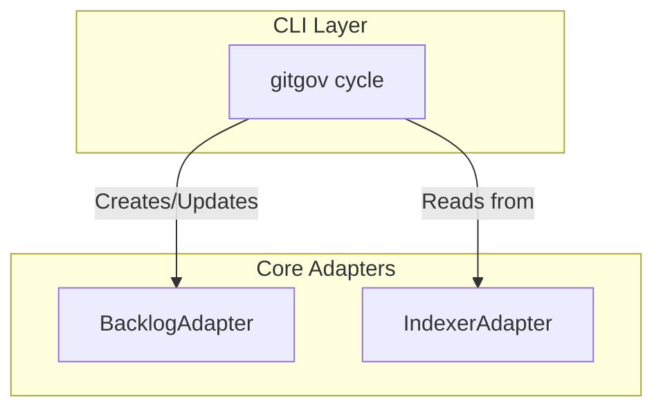

# Design Document

## Overview

The `gitgov cycle` command is the primary CLI interface for **strategic planning** in GitGovernance. It follows the **Pure CLI Interface** pattern, delegating all business logic to the `BacklogAdapter`. The command's responsibilities are to parse user input, manage a user-friendly interactive experience (including `$EDITOR` integration), and format results.

## Architecture: Orchestration via BacklogAdapter

The `cycle` command coordinates strategic operations by calling methods on the `BacklogAdapter`, which handles the complexities of record creation, state transitions, and maintaining bidirectional links with tasks.

### Key Flows

- **Read Flow (`list`, `show`)**: The command uses the `IndexerAdapter` for high-performance, cache-first data retrieval (<10ms).
- **Write Flow (`new`, `edit`, `activate`, etc.)**: The command delegates the operation to the `BacklogAdapter` and then invalidates the cache via the `IndexerAdapter`.
- **Hierarchy Management (`add-task`, `add-child`)**: The command calls specific `BacklogAdapter` methods that manage the complexities of creating and maintaining bidirectional relationships between cycles and other records.

## Components and Interfaces

### `CycleCommand` Class

The command is structured into subcommands (e.g., `new`, `list`, `add-task`). Each handler is responsible for:

1.  Parsing and validating its specific flags.
2.  Calling the appropriate `BacklogAdapter` method.
3.  Triggering a cache invalidation via `IndexerAdapter` on successful writes.
4.  Formatting the output for the console.

### Core Adapter Dependencies

- **`BacklogAdapter`**: For all cycle lifecycle and relationship management.
- **`IndexerAdapter`**: For all read operations and cache management.
- **`IdentityAdapter`**: For resolving the current actor to sign operations.

## Data Models

The command uses the canonical `CycleRecord` as its primary data model. For read operations, it displays enriched data from the `IndexerAdapter`'s cache, which includes details like task counts and parent/child relationships.

## Error Handling

The command maps technical errors from the adapters (e.g., `ProtocolViolationError`, `RecordNotFoundError`, circular reference errors) into user-friendly messages with actionable suggestions. It also handles CLI-specific errors like conflicting flags.

### Error Types and Handling

- **Validation Errors**: Invalid input data or missing required fields
- **State Transition Errors**: Attempting invalid cycle state changes
- **Relationship Errors**: Circular references or invalid parent-child relationships
- **Cache Errors**: Stale or corrupted index data requiring regeneration
- **Permission Errors**: Insufficient actor privileges for operations

## Testing Strategy

The testing approach follows a layered strategy:

### Unit Tests
- Command parsing and flag validation
- Error message formatting and user guidance
- Output formatting for different modes (JSON, verbose, etc.)

### Integration Tests
- End-to-end command execution with real adapters
- Cache invalidation and regeneration scenarios
- Cross-command interaction (e.g., creating tasks then adding to cycles)

### Performance Tests
- Read operation response times (<10ms target)
- Cache hit/miss ratios
- Large dataset handling (1000+ cycles)
