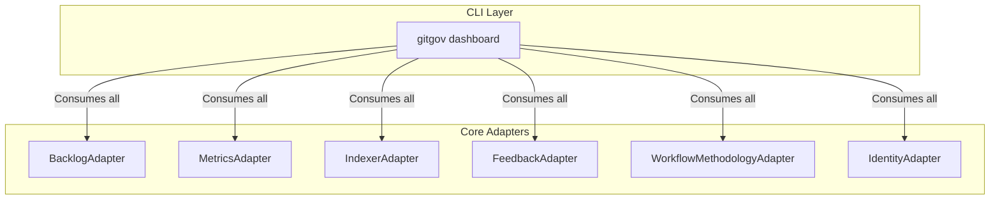

# Design Document

## Overview

The `gitgov dashboard` command is the **epic convergence** of the GitGovernance ecosystem. It is a full-screen, interactive TUI (Terminal User Interface) built with `Ink` that orchestrates 6 core adapters to provide a real-time, intelligent command and control center. Its design focuses on multi-methodology support, real-time intelligence, and interactive excellence.

## Architecture: The Ultimate Orchestrator

The `DashboardCommand` class is the ultimate expression of the "Pure CLI Interface" pattern. It acts as a sophisticated consumer for nearly every adapter in the core system, orchestrating them to build a dynamic and data-rich user experience.

### Key Flows

- **Initialization**: On launch, the command orchestrates all 6 adapters to gather a complete snapshot of the project state, leveraging the `IndexerAdapter` for performance.
- **View Rendering**: It uses the `WorkflowMethodologyAdapter` to get the `view_configs` for the currently active methodology (e.g., Kanban vs. Scrum) and renders the appropriate TUI layout.
- **Live Updates**: In `live` mode, it auto-refreshes data every 5 seconds and is architected to listen to the `EventBus` for real-time updates (a future enhancement).
- **Interactive Actions**: Keyboard shortcuts do not execute logic directly but show "educational messages" that instruct the user on the equivalent `gitgov task` or `gitgov cycle` command to run.

## Components and Interfaces

### `DashboardCommand` Class

This class manages the TUI lifecycle. Its primary responsibilities are:

1.  Initializing all 6 core adapter dependencies.
2.  Managing the main data-fetching and refresh loop.
3.  Handling keyboard input for view switching and other interactions.
4.  Passing the comprehensive, aggregated data state to the main React (`Ink`) component for rendering.

### TUI Component Architecture

The UI is built with `Ink` and composed of several key components:

- A main `Dashboard` component that manages the overall layout.
- Multiple `View` components (e.g., `RowBasedView`, `KanbanView`, `ScrumView`) that are conditionally rendered.
- Several `IntelligencePanel` components that display real-time metrics from the `MetricsAdapter`.
- An `ActivityStream` component that displays the historical log of events from the `IndexerAdapter`.

## Data Models

The command aggregates data from across the ecosystem into a single, massive state object that is passed down to the TUI. This includes:

- All tasks, cycles, and feedback from the `BacklogAdapter`.
- Enriched `IndexData` from the `IndexerAdapter`.
- `SystemStatus`, `ProductivityMetrics`, and `CollaborationMetrics` from the `MetricsAdapter`.
- The current `Actor` from the `IdentityAdapter`.
- The current `Methodology` and `ViewConfig` from the `WorkflowMethodologyAdapter`.

## Error Handling

The command is designed for resilience. Failures in one adapter (e.g., `FeedbackAdapter`) are handled gracefully, allowing the rest of the dashboard to render with a warning message, ensuring the user is never left with a crashed application.
