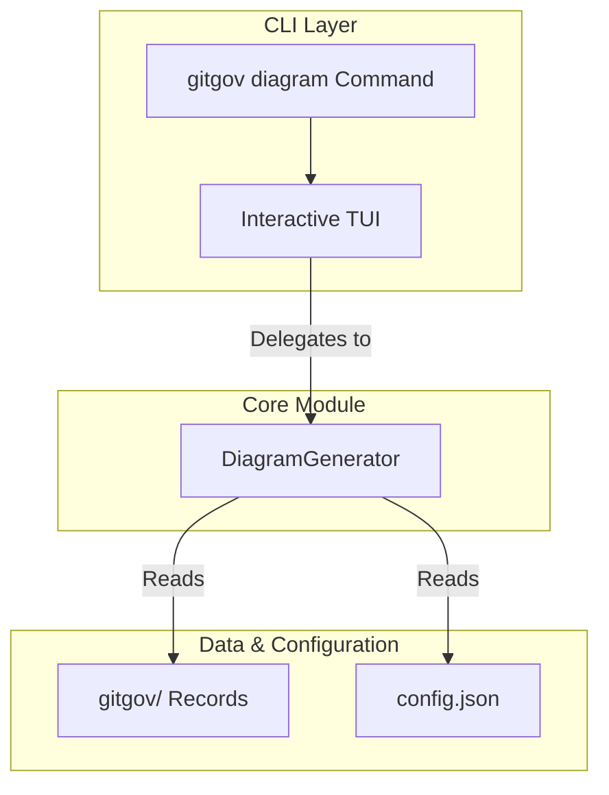

# Design Document

## Overview

The `gitgov diagram` command provides automated workflow visualization for GitGovernance projects. It follows the **Pure CLI Interface** pattern, where the command itself is a thin layer responsible for user interaction, while all core logic is delegated to the `DiagramGenerator` module in `@gitgov/core`.

The primary user interaction model is an **interactive TUI dashboard** built with `Ink`, which allows for real-time generation and watch-mode capabilities.

## Architecture

### Core Flow

1.  The `gitgov diagram` command is executed, launching the `DiagramDashboard` TUI component.
2.  The TUI provides an interactive interface for the user (e.g., pressing 'g' to generate).
3.  Upon user action, the TUI calls the `DiagramGenerator` module from the core package.
4.  The `DiagramGenerator` reads the raw `.json` record files from the `.gitgov/` directory, analyzes relationships, and generates the Mermaid diagram syntax.
5.  The TUI displays the generated diagram.

## Components and Interfaces

### `DiagramCommand` Class

The CLI command class is responsible for parsing flags (`--watch`, `--output`, etc.) and launching the main TUI component (`DiagramDashboard.tsx`).

### `DiagramGenerator` Module (from `@gitgov/core`)

This is the engine that contains all the business logic for diagram generation. The CLI command is a direct consumer of this module. Its key responsibilities include:

- Loading task and cycle records from the file system.
- Applying filters provided by the CLI.
- Analyzing the relationships between records to build a graph.
- Rendering the final Mermaid syntax.

## Data Models

The command reads the canonical `TaskRecord` and `CycleRecord` data models from the `.gitgov/` directory. It does not define its own data models, relying entirely on the protocol-defined structures.

## Error Handling

The command handles errors gracefully, such as:

- Detecting when it's run outside a GitGovernance project.
- Reporting issues with reading or parsing record files.
- Displaying data quality warnings (e.g., orphaned tasks) within the TUI.
