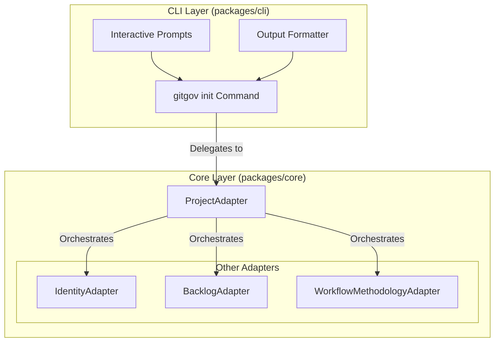
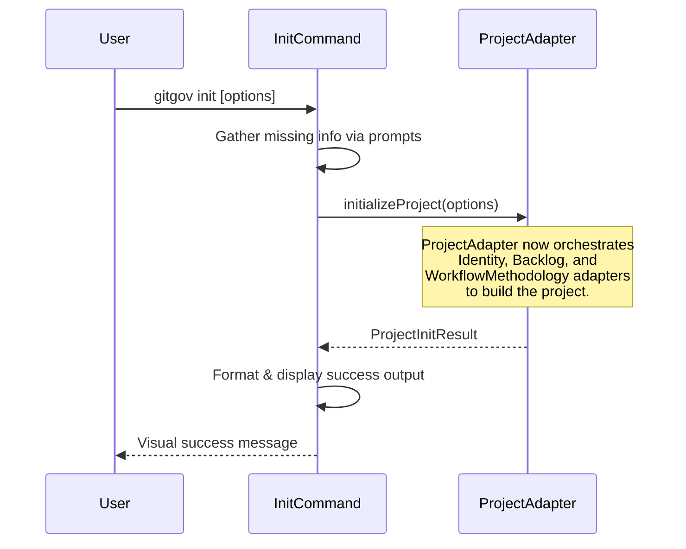

# Design Document

## Overview

The `gitgov init` command follows the **Pure CLI Interface** pattern. Its sole responsibility is to handle user interaction (parsing flags, showing prompts) and format output. All core business logic for project initialization is delegated to the `ProjectAdapter` in the `@gitgov/core` package.

This design ensures a clean separation of concerns, making the CLI easy to maintain and test, while concentrating the complex orchestration logic within the core adapter.

## Architecture



### Bootstrap Orchestration Flow

The command orchestrates the `ProjectAdapter`, which in turn coordinates the full bootstrap sequence.



## Components and Interfaces

### `InitCommand` Class

This is the core class for the command. It parses options, gathers user input, calls the `ProjectAdapter`, and formats the output. It does not contain any business logic.

### `ProjectAdapter` Interface

The `InitCommand` depends on the `IProjectAdapter` interface from `@gitgov/core`, primarily using the `initializeProject` method.

```typescript
export interface IProjectAdapter {
  initializeProject(
    options: ProjectInitOptions,
    progressCallback?: (step: number, message: string) => void
  ): Promise<ProjectInitResult>;
}
```

### Blueprint Template System

The command supports a `--blueprint` flag. The logic for loading, parsing, and applying these templates is fully encapsulated within the `ProjectAdapter`.

## Data Models

The command uses the `ProjectInitOptions` and `ProjectInitResult` data models defined in the `ProjectAdapter`'s public interface to pass data to and receive results from the core layer.

## Error Handling

The command wraps the call to `projectAdapter.initializeProject` in a `try/catch` block. It transforms any technical errors thrown by the adapter (e.g., `ProjectRootError`) into user-friendly messages with actionable suggestions, following the error handling patterns defined in its blueprint.
