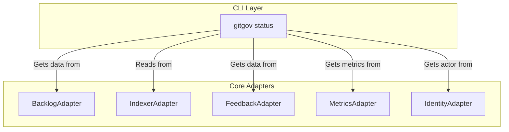

# Design Document

## Overview

The `gitgov status` command follows the **Pure CLI Interface** pattern. It is a read-only command that acts as a sophisticated client to the core adapters. Its primary role is to fetch data from multiple adapters, synthesize it into personal or global views, and render a user-friendly text-based dashboard.

## Architecture: Multi-Adapter Consumer

The command is a consumer of multiple adapters, orchestrating them to build its different views.

### Key Flows

- **Cache-First Read Flow**: The command **always** attempts to read data from the `IndexerAdapter` first to ensure a high-performance response. It includes a pre-flight check (`ensureCacheUpToDate`) to auto-regenerate the cache if it's stale.
- **Personal View (`default`)**:
  1.  Gets the current actor from `IdentityAdapter`.
  2.  Gets tasks assigned to that actor from `BacklogAdapter`.
  3.  Gets pending feedback for that actor from `FeedbackAdapter`.
  4.  Gets system health from `MetricsAdapter`.
  5.  Synthesizes this data into a personal dashboard.
- **Global View (`--all`)**:
  1.  Gets all tasks and cycles from `BacklogAdapter`.
  2.  Gets system health, productivity, and collaboration metrics from `MetricsAdapter`.
  3.  Synthesizes this data into a global project overview.

## Components and Interfaces

### `StatusCommand` Class

The command class is responsible for:

1.  Parsing flags to determine which view to render (personal vs. global) and what level of detail to show.
2.  Calling the various adapter methods to gather the necessary data.
3.  Calling private `render` methods to format the final output.

### Core Adapter Dependencies

- **`IndexerAdapter`**: The primary source for all read operations for performance.
- **`BacklogAdapter`**: Source for task and cycle data (as a fallback or for specific queries like assigned tasks).
- **`MetricsAdapter`**: The engine for all health, productivity, and collaboration scores.
- **`FeedbackAdapter`**: To fetch pending feedback for the personal view.
- **`IdentityAdapter`**: To identify the current actor for the personal view.

## Data Models

The command synthesizes data from multiple sources into two primary view models:

- **`PersonalWorkSummary`**: An aggregation of an actor's assigned tasks, pending feedback, and active cycles.
- **`SystemOverview`**: An aggregation of project-wide statistics and health alerts.

## Error Handling

The command includes robust error handling to provide user-friendly messages, especially for common issues like the project not being initialized or the actor not being configured. It uses graceful degradation to function even if some optional adapters (like `FeedbackAdapter`) fail.

### Error Scenarios

- **Project Not Initialized**: Display helpful message directing user to run `gitgov init`
- **Actor Not Configured**: Guide user to configure identity via `gitgov actor`
- **Cache Unavailable**: Fall back to direct adapter calls with performance warning
- **Adapter Failures**: Graceful degradation with partial data display
- **Network/IO Issues**: Clear error messages with suggested resolution steps

## Testing Strategy

### Unit Testing
- Test data aggregation logic for both personal and global views
- Mock all adapter dependencies to test command logic in isolation
- Verify error handling paths and graceful degradation scenarios
- Test flag parsing and output formatting

### Integration Testing
- Test end-to-end command execution with real adapter implementations
- Verify cache-first performance characteristics
- Test cross-adapter data synthesis accuracy
- Validate output formatting across different terminal environments

### Performance Testing
- Verify <200ms response time requirement with cached data
- Test performance degradation scenarios when cache is unavailable
- Measure memory usage with large datasets
