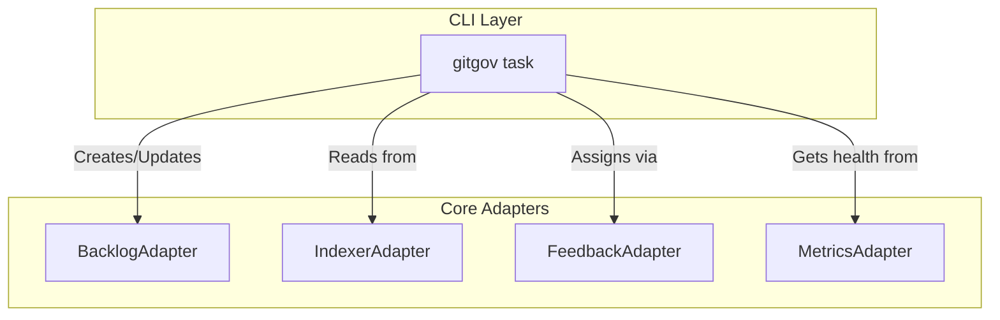

# Design Document

## Overview

The `gitgov task` command is the operational heart of the CLI. It follows the **Pure CLI Interface** pattern, where all business logic is delegated to adapters from the `@gitgov/core` package. The command's responsibility is to parse user input, call the appropriate adapter methods, and format the results for the user.

## Architecture: Multi-Adapter Orchestration

The `task` command is a primary example of multi-adapter coordination at the CLI layer.

### Key Flows

- **Read Flow (`list`, `show`)**: The command first checks the `IndexerAdapter` for fresh, cached data to ensure a high-performance response (<10ms). If the cache is stale, it auto-regenerates.
- **Write Flow (`new`, `edit`, `submit`, etc.)**: The command delegates the operation to the `BacklogAdapter` or `FeedbackAdapter`. After a successful operation, it calls `IndexerAdapter.invalidateCache()` to ensure data consistency on the next read.
- **Workflow Flow (`submit`, `approve`)**: The command calls the `BacklogAdapter`, which in turn uses the `WorkflowMethodologyAdapter` to validate the action, demonstrating the chain of delegation.

## Components and Interfaces

### `TaskCommand` Class

The command is structured into subcommands (e.g., `new`, `list`). Each subcommand handler is responsible for:

1.  Parsing and validating its specific flags.
2.  Calling the relevant adapter method(s).
3.  Formatting the result or error for the console.

### Core Adapter Dependencies

- **`BacklogAdapter`**: For all task and cycle lifecycle operations.
- **`IndexerAdapter`**: For all read operations and cache management.
- **`FeedbackAdapter`**: Specifically for the `assign` subcommand.
- **`MetricsAdapter`**: For the `--health` flag on the `show` subcommand.

## Data Models

The command uses the canonical `TaskRecord` as its primary data model. For the `list` and `show` commands, it primarily displays the enriched data from the `IndexerAdapter`'s cache, which includes derived states like `isStalled`.

## Error Handling

The command maps technical errors from the adapters (e.g., `ProtocolViolationError`, `RecordNotFoundError`) into user-friendly messages with actionable suggestions, ensuring a high-quality user experience. It also handles CLI-specific errors like conflicting flags.

## Testing Strategy

The testing approach focuses on integration testing at the CLI layer while mocking core adapters:

- **Unit Tests**: Test individual subcommand handlers with mocked adapter dependencies
- **Integration Tests**: Test complete command flows with real adapter instances using temporary `.gitgov/` directories
- **Error Path Testing**: Verify proper error mapping from adapter exceptions to user-friendly CLI messages
- **Flag Validation**: Test all flag combinations and conflicting flag scenarios
- **Output Format Testing**: Verify `--json`, `--verbose`, and `--quiet` flag behaviors across all subcommands

Each test maps directly to specific EARS requirements from the requirements document, ensuring complete coverage of the acceptance criteria.
