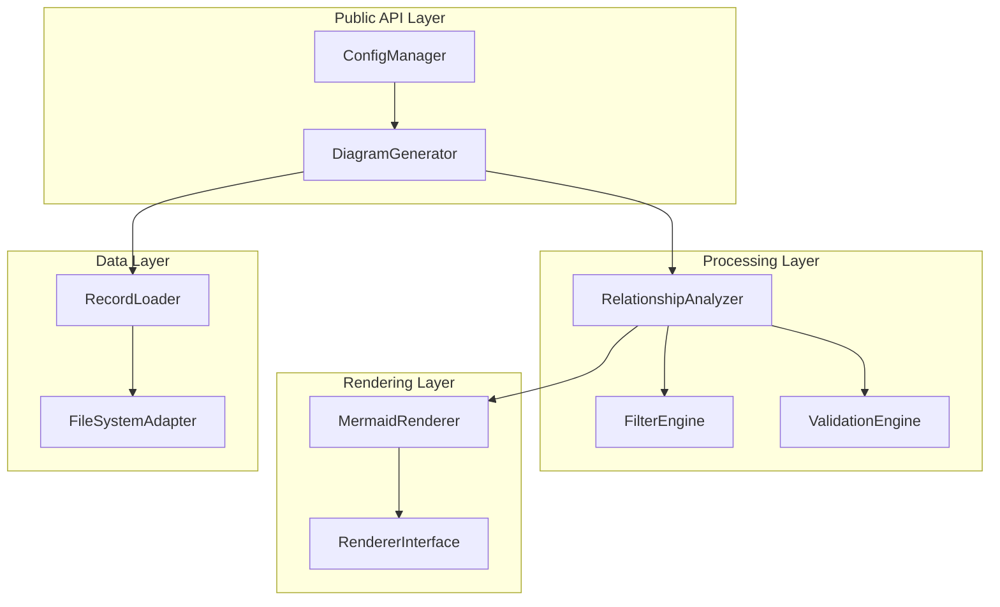

# Design Document

## Overview

The Diagram Generator Module is a core component of the GitGovernance system that transforms structured project data into visual diagrams. This module provides a clean, programmatic API for generating Mermaid diagrams from CycleRecord and TaskRecord entities while maintaining strict separation of concerns between data processing, relationship analysis, and rendering.

The module follows a three-layer architecture: data loading and validation, relationship analysis and filtering, and diagram rendering. This design ensures extensibility, testability, and performance while providing robust error handling and configuration management.

## Architecture

### High-Level Architecture



### Core Design Principles

1. **Separation of Concerns**: Clear boundaries between data loading, analysis, and rendering
2. **Extensibility**: Plugin architecture for custom renderers and filters
3. **Performance**: Streaming and efficient algorithms for large datasets
4. **Reliability**: Comprehensive validation and error handling
5. **Configuration-Driven**: Flexible configuration with sensible defaults

## Components and Interfaces

### DiagramGenerator (Main Orchestrator)

The primary entry point that coordinates the entire diagram generation process.

```typescript
interface DiagramGeneratorOptions {
  projectRoot?: string;
  filters?: FilterOptions;
  rendererOptions?: RendererOptions;
  validationLevel?: 'strict' | 'lenient' | 'none';
}

interface FilterOptions {
  cycleId?: string;
  taskId?: string;
  packageScope?: string;
  status?: string[];
  maxDepth?: number;
}

class DiagramGenerator {
  constructor(options: DiagramGeneratorOptions);
  
  // Primary generation methods
  async generateFromFiles(gitgovPath: string): Promise<DiagramResult>;
  async generateFromRecords(cycles: CycleRecord[], tasks: TaskRecord[]): Promise<DiagramResult>;
  
  // Configuration and validation
  async validateConfiguration(): Promise<ValidationResult>;
  setRenderer(renderer: RendererInterface): void;
}

interface DiagramResult {
  diagram: string;
  metadata: DiagramMetadata;
  warnings: Warning[];
}

interface DiagramMetadata {
  nodeCount: number;
  edgeCount: number;
  processingTime: number;
  filtersApplied: FilterOptions;
  rootEntities: string[];
}
```

### RelationshipAnalyzer (Graph Processing)

Handles the complex logic of building dependency graphs, detecting issues, and applying filters.

```typescript
interface GraphNode {
  id: string;
  type: 'cycle' | 'task';
  record: CycleRecord | TaskRecord;
  children: Set<string>;
  parents: Set<string>;
}

interface DependencyGraph {
  nodes: Map<string, GraphNode>;
  edges: Set<string>; // "parentId->childId" format
  roots: Set<string>;
  orphans: Set<string>;
}

class RelationshipAnalyzer {
  constructor(validationLevel: ValidationLevel);
  
  // Core analysis methods
  buildGraph(cycles: CycleRecord[], tasks: TaskRecord[]): DependencyGraph;
  detectCircularDependencies(graph: DependencyGraph): CircularDependency[];
  validateIntegrity(graph: DependencyGraph): ValidationResult;
  
  // Filtering capabilities
  applyFilters(graph: DependencyGraph, filters: FilterOptions): DependencyGraph;
  findConnectedComponents(graph: DependencyGraph): GraphNode[][];
  
  // Quality assurance
  detectDuplicates(records: (CycleRecord | TaskRecord)[]): DuplicateReport;
  validateReferences(graph: DependencyGraph): ReferenceValidationResult;
}

interface CircularDependency {
  path: string[];
  type: 'cycle-cycle' | 'task-cycle' | 'mixed';
}
```

### MermaidRenderer (Output Generation)

Converts the processed graph structure into valid Mermaid syntax with semantic visual representation.

```typescript
interface RendererOptions {
  theme?: 'default' | 'dark' | 'neutral';
  direction?: 'TD' | 'LR' | 'BT' | 'RL';
  nodeSpacing?: number;
  includeMetadata?: boolean;
  maxLabelLength?: number;
}

interface RendererInterface {
  render(graph: DependencyGraph, options: RendererOptions): string;
  validateOutput(diagram: string): ValidationResult;
}

class MermaidRenderer implements RendererInterface {
  constructor(options: RendererOptions);
  
  // Core rendering methods
  render(graph: DependencyGraph, options: RendererOptions): string;
  generateNodeSyntax(node: GraphNode): string;
  generateEdgeSyntax(parentId: string, childId: string): string;
  
  // Utility methods
  sanitizeLabel(text: string): string;
  optimizeLayout(graph: DependencyGraph): LayoutOptimization;
  validateOutput(diagram: string): ValidationResult;
}
```

### ConfigManager (Configuration Integration)

Provides typed access to GitGovernance configuration with intelligent defaults.

```typescript
interface DiagramConfig {
  rootCycle?: string;
  defaultFilters?: FilterOptions;
  rendererDefaults?: RendererOptions;
  performanceLimits?: PerformanceLimits;
}

interface PerformanceLimits {
  maxNodes?: number;
  maxEdges?: number;
  timeoutMs?: number;
  memoryLimitMB?: number;
}

class ConfigManager {
  constructor(projectRoot: string);
  
  // Configuration access
  async getRootCycle(): Promise<string | null>;
  async getDiagramConfig(): Promise<DiagramConfig>;
  async findProjectRoot(startPath?: string): Promise<string>;
  
  // Validation and defaults
  validateConfiguration(config: DiagramConfig): ValidationResult;
  mergeWithDefaults(config: Partial<DiagramConfig>): DiagramConfig;
}
```

### RecordLoader (Data Access)

Handles efficient loading and parsing of GitGovernance records with streaming support for large datasets.

```typescript
interface LoaderOptions {
  streaming?: boolean;
  batchSize?: number;
  includeInvalid?: boolean;
  progressCallback?: (progress: LoadProgress) => void;
}

interface LoadProgress {
  filesProcessed: number;
  totalFiles: number;
  recordsLoaded: number;
  errorsEncountered: number;
}

class RecordLoader {
  constructor(options: LoaderOptions);
  
  // Loading methods
  async loadCycles(cyclesPath: string): Promise<CycleRecord[]>;
  async loadTasks(tasksPath: string): Promise<TaskRecord[]>;
  async loadAllRecords(gitgovPath: string): Promise<{cycles: CycleRecord[], tasks: TaskRecord[]}>;
  
  // Streaming support
  createCycleStream(cyclesPath: string): AsyncIterable<CycleRecord>;
  createTaskStream(tasksPath: string): AsyncIterable<TaskRecord>;
  
  // Validation during loading
  validateRecord(record: any, filePath: string): ValidationResult;
}
```

## Data Models

### Core Record Types

The module works with standardized GitGovernance record types:

```typescript
interface CycleRecord {
  id: string;
  title: string;
  description?: string;
  status: 'planning' | 'active' | 'completed' | 'archived';
  childCycleIds: string[];
  taskIds: string[];
  packageScope?: string;
  metadata?: Record<string, any>;
}

interface TaskRecord {
  id: string;
  description: string;
  status: 'not_started' | 'in_progress' | 'completed' | 'blocked';
  assignee?: string;
  packageScope?: string;
  dependencies?: string[];
  metadata?: Record<string, any>;
}
```

### Internal Processing Types

```typescript
interface ProcessedRecord {
  original: CycleRecord | TaskRecord;
  normalized: NormalizedRecord;
  relationships: RelationshipInfo;
  validationStatus: ValidationStatus;
}

interface NormalizedRecord {
  id: string;
  type: 'cycle' | 'task';
  title: string;
  status: string;
  packageScope: string;
}

interface RelationshipInfo {
  children: string[];
  parents: string[];
  depth: number;
  isRoot: boolean;
  isOrphan: boolean;
}
```

## Error Handling

### Error Hierarchy

```typescript
abstract class DiagramModuleError extends Error {
  abstract code: string;
  abstract severity: 'error' | 'warning' | 'info';
}

class ValidationError extends DiagramModuleError {
  code = 'VALIDATION_ERROR';
  severity = 'error' as const;
  
  constructor(
    message: string,
    public field: string,
    public filePath?: string,
    public recordId?: string
  ) {
    super(message);
  }
}

class CircularDependencyError extends DiagramModuleError {
  code = 'CIRCULAR_DEPENDENCY';
  severity = 'error' as const;
  
  constructor(
    public cyclePath: string[],
    public dependencyType: 'cycle-cycle' | 'task-cycle' | 'mixed'
  ) {
    super(`Circular dependency detected: ${cyclePath.join(' -> ')}`);
  }
}

class ConfigurationError extends DiagramModuleError {
  code = 'CONFIGURATION_ERROR';
  severity = 'error' as const;
  
  constructor(
    message: string,
    public configPath?: string,
    public invalidFields?: string[]
  ) {
    super(message);
  }
}

class FileSystemError extends DiagramModuleError {
  code = 'FILESYSTEM_ERROR';
  severity = 'error' as const;
  
  constructor(
    message: string,
    public operation: string,
    public path: string,
    public originalError?: Error
  ) {
    super(message);
  }
}

class ResourceError extends DiagramModuleError {
  code = 'RESOURCE_ERROR';
  severity = 'error' as const;
  
  constructor(
    message: string,
    public resourceType: 'memory' | 'time' | 'nodes' | 'edges',
    public limit: number,
    public actual: number
  ) {
    super(message);
  }
}
```

### Error Recovery Strategies

1. **Validation Errors**: Collect and report all validation issues, continue processing valid records
2. **Circular Dependencies**: Detect and report cycles, optionally break cycles at specified points
3. **Missing References**: Warn about broken references, create placeholder nodes if needed
4. **Resource Limits**: Implement graceful degradation with progress reporting
5. **File System Issues**: Retry with exponential backoff, fallback to cached data if available

## Testing Strategy

### Unit Testing Approach

```typescript
// Example test structure for core components
describe('DiagramGenerator', () => {
  describe('generateFromRecords', () => {
    it('should generate valid Mermaid syntax for simple hierarchy');
    it('should handle empty record sets gracefully');
    it('should apply filters correctly');
    it('should throw ValidationError for malformed records');
  });
  
  describe('configuration integration', () => {
    it('should use rootCycle from config when no filters provided');
    it('should merge user options with config defaults');
    it('should validate configuration before processing');
  });
});

describe('RelationshipAnalyzer', () => {
  describe('circular dependency detection', () => {
    it('should detect simple cycles in cycle hierarchy');
    it('should detect complex multi-level cycles');
    it('should provide complete cycle path in error');
  });
  
  describe('filtering logic', () => {
    it('should include child cycles when filtering by parent cycle');
    it('should include parent cycles when filtering by task');
    it('should respect depth limits in hierarchical filtering');
  });
});

describe('MermaidRenderer', () => {
  describe('syntax generation', () => {
    it('should generate hexagonal nodes for cycles');
    it('should generate rectangular nodes for tasks');
    it('should sanitize labels to prevent syntax conflicts');
    it('should generate valid edge syntax for relationships');
  });
});
```

### Integration Testing

1. **End-to-End Workflow**: Test complete generation pipeline with realistic data
2. **Configuration Integration**: Verify proper config loading and application
3. **Error Handling**: Test error scenarios with malformed data and missing files
4. **Performance**: Validate performance characteristics with large datasets
5. **Output Validation**: Ensure generated Mermaid diagrams render correctly

### Performance Testing

```typescript
describe('Performance Tests', () => {
  it('should handle 1000+ nodes within memory limits');
  it('should complete generation within timeout limits');
  it('should use streaming for large datasets');
  it('should maintain O(n log n) complexity for relationship analysis');
});
```

## Performance Considerations

### Memory Management

1. **Streaming Processing**: Use AsyncIterable for large record sets
2. **Lazy Loading**: Load records on-demand during filtering
3. **Memory Monitoring**: Track memory usage and implement limits
4. **Garbage Collection**: Explicit cleanup of large intermediate objects

### Algorithm Efficiency

1. **Graph Algorithms**: Use efficient data structures (Map, Set) for relationship tracking
2. **Circular Detection**: Implement DFS-based cycle detection with early termination
3. **Filtering**: Apply filters during graph construction to minimize processing
4. **String Operations**: Use StringBuilder pattern for large diagram generation

### Caching Strategy

```typescript
interface CacheOptions {
  enabled: boolean;
  ttlMs: number;
  maxSize: number;
  keyStrategy: 'content-hash' | 'file-mtime' | 'explicit';
}

class DiagramCache {
  constructor(options: CacheOptions);
  
  async get(key: string): Promise<DiagramResult | null>;
  async set(key: string, result: DiagramResult): Promise<void>;
  async invalidate(pattern?: string): Promise<void>;
  
  // Cache key generation
  generateKey(records: (CycleRecord | TaskRecord)[], filters: FilterOptions): string;
}
```

## Security Considerations

### Input Validation

1. **Path Traversal**: Validate all file paths to prevent directory traversal attacks
2. **JSON Parsing**: Use safe JSON parsing with size limits
3. **Label Sanitization**: Prevent injection attacks through diagram labels
4. **Resource Limits**: Enforce limits to prevent DoS through large inputs

### Output Safety

1. **Mermaid Injection**: Sanitize all user content in diagram output
2. **File Permissions**: Respect file system permissions when reading records
3. **Error Information**: Avoid leaking sensitive path information in errors
4. **Configuration Security**: Validate configuration sources and permissions

## Configuration Schema

```typescript
interface DiagramModuleConfig {
  // Core settings
  defaultRenderer: 'mermaid' | string;
  validationLevel: 'strict' | 'lenient' | 'none';
  
  // Performance settings
  performance: {
    maxNodes: number;
    maxEdges: number;
    timeoutMs: number;
    memoryLimitMB: number;
    enableCaching: boolean;
  };
  
  // Rendering defaults
  rendering: {
    theme: 'default' | 'dark' | 'neutral';
    direction: 'TD' | 'LR' | 'BT' | 'RL';
    nodeSpacing: number;
    maxLabelLength: number;
    includeMetadata: boolean;
  };
  
  // Filter defaults
  filters: {
    defaultDepth: number;
    includeOrphans: boolean;
    statusFilter: string[];
  };
}
```

This design provides a robust, extensible foundation for the Diagram Generator Module that addresses all requirements while maintaining clean architecture and excellent performance characteristics.