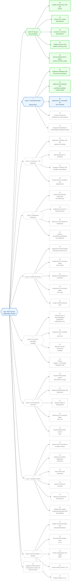

```mermaid
flowchart LR
    %% Auto-generated on 2025-11-26T02:14:01.576Z
    %% Source: .gitgov/ entities

    cycle_epic_multi_machine_collaboration_system{{"🎯<br/>Epic: Multi-machine<br/>Collaboration System"}}
    cycle_cycle_00_setup__documentation{{"🎯<br/>Cycle 00: Setup &<br/>Documentation"}}
    cycle_cycle_1_syncmodule_basic___manual_sync{{"🎯<br/>Cycle 1: SyncModule Basic -<br/>Manual Sync"}}
    cycle_cycle_2_local_sync___file_watchers{{"🎯<br/>Cycle 2: Local Sync - File<br/>Watchers"}}
    cycle_cycle_3_dashboard_integration{{"🎯<br/>Cycle 3: Dashboard Integration"}}
    cycle_cycle_4_conflict_resolution{{"🎯<br/>Cycle 4: Conflict Resolution"}}
    cycle_cycle_5_auto_sync_immediate_strategy{{"🎯<br/>Cycle 5: Auto-Sync Immediate<br/>Strategy"}}
    cycle_cycle_6_pull_scheduler___auto_pull{{"🎯<br/>Cycle 6: Pull Scheduler -<br/>Auto-Pull"}}
    cycle_cycle_7_quality__polish{{"🎯<br/>Cycle 7: Quality & Polish"}}
    cycle_cycle_8_documentation__release{{"🎯<br/>Cycle 8: Documentation &<br/>Release"}}
    task_update_protocol_docs_with_sync_section["📋<br/>Update Protocol docs with sync<br/>section"]
    task_create_cli_command_specifications["📋<br/>Create CLI command<br/>specifications"]
    task_create_core_module_specifications["📋<br/>Create Core module<br/>specifications"]
    task_validate_structure_with_auditors_scoring_710["📋<br/>Validate structure with<br/>auditors (scoring ≥7/10)"]
    task_implement_gitmodule_with_low_level_git_operations["📋<br/>Implement GitModule with<br/>low-level Git operations"]
    task_implement_syncmodule_with_pushstate_pullstate_reso["📋<br/>Implement SyncModule with<br/>pushState, pullState,<br/>resolveConflict"]
    task_implement_cli_commands_for_sync_pushpull["📋<br/>Implement CLI commands for<br/>sync push/pull"]
    task_create_unit_tests_for_gitmodule_and_syncmodule["📋<br/>Create unit tests for<br/>GitModule and SyncModule"]
    task_integrate_syncmodule_in_projectadapterinitializepr["📋<br/>Integrate SyncModule in<br/>ProjectAdapter.initializeProject()"]
    task_implement_localsync_with_file_watchers_chokidar["📋<br/>Implement LocalSync with file<br/>watchers (chokidar)"]
    task_add_deduplication_in_eventbus["📋<br/>Add deduplication in EventBus"]
    task_integrate_localsync_with_eventbus_and_adapters["📋<br/>Integrate LocalSync with<br/>EventBus and Adapters"]
    task_create_tests_for_localsync_and_deduplication["📋<br/>Create tests for LocalSync and<br/>deduplication"]
    task_create_syncindicator_component_for_dashboard["📋<br/>Create SyncIndicator component<br/>for Dashboard"]
    task_implement_auto_pull_on_dashboard_start["📋<br/>Implement auto-pull on<br/>Dashboard start"]
    task_add_sync_event_listeners_in_dashboard["📋<br/>Add sync event listeners in<br/>Dashboard"]
    task_expose_syncmodulegetstatus_for_dashboard["📋<br/>Expose SyncModule.getStatus()<br/>for Dashboard"]
    task_implement_resolveconflict_with_governed_ceremony["📋<br/>Implement resolveConflict()<br/>with governed ceremony"]
    task_implement_cli_command_gitgov_sync_resolve["📋<br/>Implement CLI command gitgov<br/>sync resolve"]
    task_integrate_verifyintegrity_in_pushstate["📋<br/>Integrate verifyIntegrity() in<br/>pushState"]
    task_create_conflict_resolution_tests["📋<br/>Create conflict resolution<br/>tests"]
    task_implement_cli_command_gitgov_sync_audit["📋<br/>Implement CLI command gitgov<br/>sync audit"]
    task_add_auto_sync_in_backlogadapter_createtask_updatet["📋<br/>Add auto-sync in<br/>BacklogAdapter (createTask,<br/>updateTask, etc.)"]
    task_implement_error_handling_for_auto_sync["📋<br/>Implement error handling for<br/>auto-sync"]
    task_maintain_manual_commands_available["📋<br/>Maintain manual commands<br/>available"]
    task_create_adaptersyncmodule_integration_tests["📋<br/>Create adapter→syncModule<br/>integration tests"]
    task_create_pullscheduler_service_with_periodic_cronjob["📋<br/>Create PullScheduler service<br/>with periodic cronjob"]
    task_integrate_pullscheduler_with_dashboard["📋<br/>Integrate PullScheduler with<br/>Dashboard"]
    task_handle_conflicts_in_pullscheduler["📋<br/>Handle conflicts in<br/>PullScheduler"]
    task_create_pullscheduler_service_tests["📋<br/>Create PullScheduler service<br/>tests"]
    task_implement_cli_command_gitgov_sync_auto["📋<br/>Implement CLI command gitgov<br/>sync auto"]
    task_create_end_to_end_tests_for_complete_system["📋<br/>Create end-to-end tests for<br/>complete system"]
    task_implement_complete_logging_per_component["📋<br/>Implement complete logging per<br/>component"]
    task_achieve_80_test_coverage["📋<br/>Achieve >80% test coverage"]
    task_code_review_and_refactoring["📋<br/>Code review and refactoring"]
    task_measure_and_optimize_performance["📋<br/>Measure and optimize<br/>performance"]
    task_validate_and_update_troubleshooting_guide_with_rea["📋<br/>Validate and update<br/>troubleshooting guide with<br/>real problems"]
    task_document_all_changes_since_v100["📋<br/>Document all changes since<br/>v1.0.0"]
    task_update_all_documentation_with_final_implementation["📋<br/>Update all documentation with<br/>final implementation"]
    task_create_configuration_and_usage_guide["📋<br/>Create configuration and usage<br/>guide"]
    task_create_release_notes_v110["📋<br/>Create release notes v1.1.0"]
    task_publish_release_v110["📋<br/>Publish release v1.1.0"]
    task_implement_multi_machine_collaboration_system_for_g["📦<br/>Implement Multi-machine<br/>Collaboration System for<br/>GitGovernance"]
    task_add_syncstatus_field_to_gitgov_context_command_out["📋<br/>Add syncStatus field to gitgov<br/>context command output"]

    %% ONLY hierarchical relationships from protocol
    %% Source: CycleRecord.childCycleIds and CycleRecord.taskIds
    cycle_epic_multi_machine_collaboration_system --> cycle_cycle_00_setup__documentation
    cycle_epic_multi_machine_collaboration_system --> cycle_cycle_1_syncmodule_basic___manual_sync
    cycle_epic_multi_machine_collaboration_system --> cycle_cycle_2_local_sync___file_watchers
    cycle_epic_multi_machine_collaboration_system --> cycle_cycle_3_dashboard_integration
    cycle_epic_multi_machine_collaboration_system --> cycle_cycle_4_conflict_resolution
    cycle_epic_multi_machine_collaboration_system --> cycle_cycle_5_auto_sync_immediate_strategy
    cycle_epic_multi_machine_collaboration_system --> cycle_cycle_6_pull_scheduler___auto_pull
    cycle_epic_multi_machine_collaboration_system --> cycle_cycle_7_quality__polish
    cycle_epic_multi_machine_collaboration_system --> cycle_cycle_8_documentation__release
    cycle_epic_multi_machine_collaboration_system --> task_implement_multi_machine_collaboration_system_for_g
    cycle_cycle_00_setup__documentation --> task_update_protocol_docs_with_sync_section
    cycle_cycle_00_setup__documentation --> task_create_core_module_specifications
    cycle_cycle_00_setup__documentation --> task_create_cli_command_specifications
    cycle_cycle_00_setup__documentation --> task_validate_structure_with_auditors_scoring_710
    cycle_cycle_00_setup__documentation --> task_add_syncstatus_field_to_gitgov_context_command_out
    cycle_cycle_1_syncmodule_basic___manual_sync --> task_implement_gitmodule_with_low_level_git_operations
    cycle_cycle_1_syncmodule_basic___manual_sync --> task_implement_syncmodule_with_pushstate_pullstate_reso
    cycle_cycle_1_syncmodule_basic___manual_sync --> task_implement_cli_commands_for_sync_pushpull
    cycle_cycle_1_syncmodule_basic___manual_sync --> task_create_unit_tests_for_gitmodule_and_syncmodule
    cycle_cycle_1_syncmodule_basic___manual_sync --> task_integrate_syncmodule_in_projectadapterinitializepr
    cycle_cycle_2_local_sync___file_watchers --> task_implement_localsync_with_file_watchers_chokidar
    cycle_cycle_2_local_sync___file_watchers --> task_add_deduplication_in_eventbus
    cycle_cycle_2_local_sync___file_watchers --> task_integrate_localsync_with_eventbus_and_adapters
    cycle_cycle_2_local_sync___file_watchers --> task_create_tests_for_localsync_and_deduplication
    cycle_cycle_3_dashboard_integration --> task_create_syncindicator_component_for_dashboard
    cycle_cycle_3_dashboard_integration --> task_implement_auto_pull_on_dashboard_start
    cycle_cycle_3_dashboard_integration --> task_add_sync_event_listeners_in_dashboard
    cycle_cycle_3_dashboard_integration --> task_expose_syncmodulegetstatus_for_dashboard
    cycle_cycle_4_conflict_resolution --> task_implement_resolveconflict_with_governed_ceremony
    cycle_cycle_4_conflict_resolution --> task_implement_cli_command_gitgov_sync_resolve
    cycle_cycle_4_conflict_resolution --> task_integrate_verifyintegrity_in_pushstate
    cycle_cycle_4_conflict_resolution --> task_implement_cli_command_gitgov_sync_audit
    cycle_cycle_4_conflict_resolution --> task_create_conflict_resolution_tests
    cycle_cycle_5_auto_sync_immediate_strategy --> task_add_auto_sync_in_backlogadapter_createtask_updatet
    cycle_cycle_5_auto_sync_immediate_strategy --> task_implement_error_handling_for_auto_sync
    cycle_cycle_5_auto_sync_immediate_strategy --> task_maintain_manual_commands_available
    cycle_cycle_5_auto_sync_immediate_strategy --> task_create_adaptersyncmodule_integration_tests
    cycle_cycle_6_pull_scheduler___auto_pull --> task_create_pullscheduler_service_with_periodic_cronjob
    cycle_cycle_6_pull_scheduler___auto_pull --> task_integrate_pullscheduler_with_dashboard
    cycle_cycle_6_pull_scheduler___auto_pull --> task_handle_conflicts_in_pullscheduler
    cycle_cycle_6_pull_scheduler___auto_pull --> task_implement_cli_command_gitgov_sync_auto
    cycle_cycle_6_pull_scheduler___auto_pull --> task_create_pullscheduler_service_tests
    cycle_cycle_7_quality__polish --> task_create_end_to_end_tests_for_complete_system
    cycle_cycle_7_quality__polish --> task_implement_complete_logging_per_component
    cycle_cycle_7_quality__polish --> task_code_review_and_refactoring
    cycle_cycle_7_quality__polish --> task_achieve_80_test_coverage
    cycle_cycle_7_quality__polish --> task_measure_and_optimize_performance
    cycle_cycle_7_quality__polish --> task_validate_and_update_troubleshooting_guide_with_rea
    cycle_cycle_8_documentation__release --> task_update_all_documentation_with_final_implementation
    cycle_cycle_8_documentation__release --> task_document_all_changes_since_v100
    cycle_cycle_8_documentation__release --> task_create_configuration_and_usage_guide
    cycle_cycle_8_documentation__release --> task_create_release_notes_v110
    cycle_cycle_8_documentation__release --> task_publish_release_v110

    %% Status styling (mandatory color scheme)
    classDef statusDraft fill:#ffffff,stroke:#cccccc,stroke-width:2px,color:#666666
    classDef statusReady fill:#ffffeb,stroke:#cccc00,stroke-width:2px,color:#666600
    classDef statusInProgress fill:#ebf5ff,stroke:#0066cc,stroke-width:2px,color:#003366
    classDef statusDone fill:#ebffeb,stroke:#00cc00,stroke-width:2px,color:#006600
    classDef statusBlocked fill:#ffebeb,stroke:#cc0000,stroke-width:2px,color:#660000
    classDef statusEpicPaused fill:#f3e5f5,stroke:#9c27b0,stroke-width:2px,color:#4a148c
    classDef statusArchived fill:#f5f5f5,stroke:#666666,stroke-width:2px,color:#333333

    %% Apply styles based on entity status
    class cycle_epic_multi_machine_collaboration_system,cycle_cycle_1_syncmodule_basic___manual_sync,task_implement_cli_commands_for_sync_pushpull statusInProgress
    class cycle_cycle_00_setup__documentation,task_update_protocol_docs_with_sync_section,task_create_cli_command_specifications,task_create_core_module_specifications,task_validate_structure_with_auditors_scoring_710,task_implement_gitmodule_with_low_level_git_operations,task_implement_syncmodule_with_pushstate_pullstate_reso,task_add_syncstatus_field_to_gitgov_context_command_out statusDone
    class cycle_cycle_2_local_sync___file_watchers,cycle_cycle_3_dashboard_integration,cycle_cycle_4_conflict_resolution,cycle_cycle_5_auto_sync_immediate_strategy,cycle_cycle_6_pull_scheduler___auto_pull,cycle_cycle_7_quality__polish,cycle_cycle_8_documentation__release,task_create_unit_tests_for_gitmodule_and_syncmodule,task_integrate_syncmodule_in_projectadapterinitializepr,task_implement_localsync_with_file_watchers_chokidar,task_add_deduplication_in_eventbus,task_integrate_localsync_with_eventbus_and_adapters,task_create_tests_for_localsync_and_deduplication,task_create_syncindicator_component_for_dashboard,task_implement_auto_pull_on_dashboard_start,task_add_sync_event_listeners_in_dashboard,task_expose_syncmodulegetstatus_for_dashboard,task_implement_resolveconflict_with_governed_ceremony,task_implement_cli_command_gitgov_sync_resolve,task_integrate_verifyintegrity_in_pushstate,task_create_conflict_resolution_tests,task_implement_cli_command_gitgov_sync_audit,task_add_auto_sync_in_backlogadapter_createtask_updatet,task_implement_error_handling_for_auto_sync,task_maintain_manual_commands_available,task_create_adaptersyncmodule_integration_tests,task_create_pullscheduler_service_with_periodic_cronjob,task_integrate_pullscheduler_with_dashboard,task_handle_conflicts_in_pullscheduler,task_create_pullscheduler_service_tests,task_implement_cli_command_gitgov_sync_auto,task_create_end_to_end_tests_for_complete_system,task_implement_complete_logging_per_component,task_achieve_80_test_coverage,task_code_review_and_refactoring,task_measure_and_optimize_performance,task_validate_and_update_troubleshooting_guide_with_rea,task_document_all_changes_since_v100,task_update_all_documentation_with_final_implementation,task_create_configuration_and_usage_guide,task_create_release_notes_v110,task_publish_release_v110,task_implement_multi_machine_collaboration_system_for_g statusDraft
```