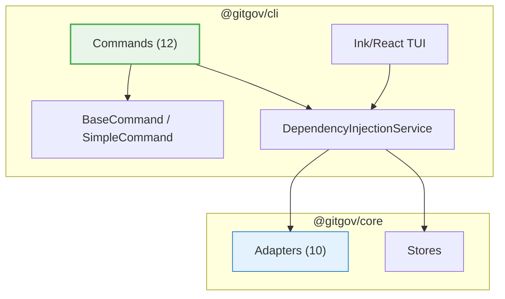

# @gitgov/cli: The Command Interface for GitGovernance

[](https://www.npmjs.com/package/@gitgov/cli)
[](https://opensource.org/licenses/Apache-2.0)
[](./tsconfig.json)

`@gitgov/cli` is the canonical command-line interface for the GitGovernance ecosystem. Designed for collaboration between humans and AI agents directly from the terminal.


**You don't need to memorize commands.** Talk to your repository through the agent. Ask for project status, what to work on, or request new tasks in natural language. The agent translates your intent into precise commands.

```
You:    "What should I work on next?"
Agent:  gitgov status --alerts → gitgov task list --status ready → "Task X is ready, want me to activate it?"

You:    "Create a task for the login bug"
Agent:  gitgov task new "Fix login authentication bug" --priority high

You:    "How's the sprint going?"
Agent:  gitgov status --all --cycles --health → "Sprint is 70% done, 3 tasks active, 1 blocked"
```

## Install

```bash
npm install -g @gitgov/cli
```

## Quick Start

```bash
cd my-project
git init
gitgov init --name "My Project"
gitgov indexer
gitgov status
```

## Commands

```
Usage: gitgov [options] [command]

GitGovernance CLI - AI-first governance for intelligent work

Commands:
  init [options]         Initialize GitGovernance project
  task|t                 Create and manage TaskRecords
  cycle|c                Create and manage CycleRecords
  status [options]       Show intelligent project status dashboard
  dashboard [options]    Launch interactive TUI dashboard
  indexer [options]      Control local cache system
  diagram|d [options]    Generate workflow diagrams
  lint [options] [path]  Validate GitGovernance records
  audit [options]        Audit source code (PII/secrets, GDPR)
  agent                  Manage and run GitGov agents
  sync                   State synchronization (push/pull/resolve/audit)
  context [options]      Query working context for agents and automation
  push [options]         Alias for "gitgov sync push"
  pull [options]         Alias for "gitgov sync pull"
```

Every command supports `--json`, `--verbose`, and `--quiet` flags. Run `gitgov <command> --help` for full details.

### Task Workflow

The core workflow for task management:

```
draft -> review -> ready -> active -> done -> archived

  Create:    gitgov task new "Fix login bug"
  Submit:    gitgov task submit <taskId>
  Approve:   gitgov task approve <taskId>
  Activate:  gitgov task activate <taskId>
  Complete:  gitgov task complete <taskId>
```

15 subcommands: `new`, `list`, `show`, `submit`, `approve`, `activate`, `pause`, `resume`, `complete`, `cancel`, `reject`, `delete`, `assign`, `edit`, `promote`

### Cycle Management

Strategic planning with cycles:

```
  Create:    gitgov cycle new "Sprint Q1" -d "API focus"
  Activate:  gitgov cycle activate <cycleId>
  Add task:  gitgov cycle add-task <cycleId> --task <taskId>
  Complete:  gitgov cycle complete <cycleId>
```

10 subcommands: `new`, `list`, `show`, `activate`, `complete`, `add-task`, `remove-task`, `move-task`, `edit`, `add-child`

### Project Monitoring

```bash
gitgov status                          # Personal dashboard
gitgov status --all --health --team    # Full project view
gitgov status --alerts --json          # For automation
gitgov dashboard                       # Interactive TUI (Ink/React)
```

### Sync

```bash
gitgov sync push --message "Sprint 1"  # Publish to gitgov-state branch
gitgov sync pull                        # Pull remote changes
gitgov sync audit                       # Verify integrity
gitgov sync resolve --reason "..."      # Resolve conflicts
```

## Architecture



The CLI is a thin UI layer. All business logic lives in `@gitgov/core`. Commands delegate to adapters via a dependency injection service.

| Technology | Role |
|------------|------|
| Commander.js | Command framework (flags, subcommands, help) |
| Ink + React | Interactive TUI (`gitgov dashboard`) |
| @gitgov/core | Business logic (adapters, stores, validators) |
| esbuild | Bundle to single `gitgov.mjs` for distribution |

## Development

```bash
# Clone and setup
git clone https://github.com/gitgovernance/monorepo.git
cd monorepo && pnpm install

# Development
cd packages/cli
pnpm dev status          # Run commands directly via tsx
pnpm dev task list       # Hot-reload development
pnpm dev dashboard       # TUI development

# Verify (build + test + pack)
pnpm verify

# Individual steps
pnpm tsc --noEmit        # Type check
pnpm build               # esbuild bundle
pnpm test                # Jest tests
```

### Demo / E2E Testing

```bash
cd packages/cli
pnpm build && npm link

# Use from any directory
cd /tmp/demo && git init
gitgov init --name "Demo"
gitgov status

# Cleanup
npm unlink
```

## License

This package is licensed under the [Apache License 2.0](https://opensource.org/licenses/Apache-2.0).

## Links

- **GitHub:** https://github.com/gitgovernance/monorepo/tree/main/packages/cli
- **NPM:** https://www.npmjs.com/package/@gitgov/cli

---

Built with care by the GitGovernance team.
