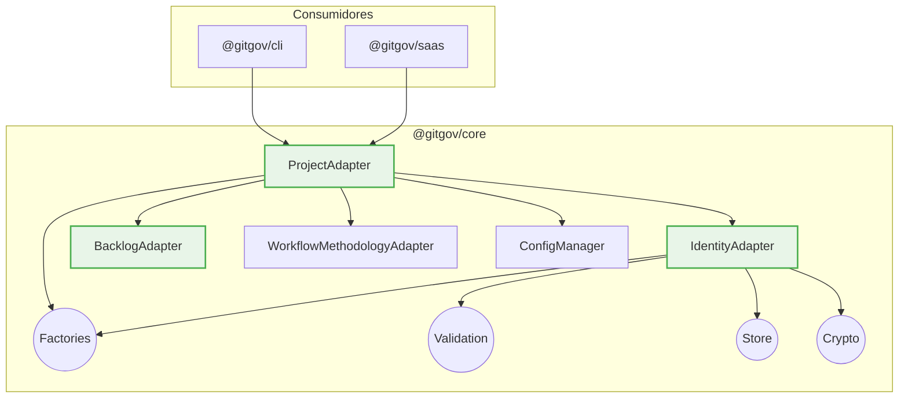

# @gitgov/core: The Governance Engine

[](https://www.npmjs.com/package/@gitgov/core)
[](https://opensource.org/licenses/MPL-2.0)
[](./src)
[](./tsconfig.json)

`@gitgov/core` is the **universal SDK** for the GitGovernance ecosystem. It provides a type-safe, local-first, and schema-driven API to manage identities, agents, and workflows in software projects.

## 🚀 Quick Start

This example initializes a complete GitGovernance project in a new directory, creating the necessary configuration, the first user actor, and a root cycle for tasks.

```typescript
import {
  ProjectAdapter,
  ConfigManager,
  RecordStore,
  IdentityAdapter,
  BacklogAdapter,
  WorkflowMethodologyAdapter,
} from "@gitgov/core";
import path from "path";
import fs from "fs/promises";

// --- Setup a temporary directory for the demo ---
const projectRoot = path.join(__dirname, "temp-project");
await fs.rm(projectRoot, { recursive: true, force: true });
await fs.mkdir(projectRoot, { recursive: true });
process.chdir(projectRoot);
// In a real project, you would run this inside an existing git repo.
// For this demo, we simulate it.
await fs.mkdir(path.join(projectRoot, ".git"), { recursive: true });
// --- End Setup ---

// 1. Instantiate all core adapters and their dependencies
const identityAdapter = new IdentityAdapter();
const backlogAdapter = new BacklogAdapter({
  taskStore: new RecordStore("tasks"),
  cycleStore: new RecordStore("cycles"),
  workflowMethodology: new WorkflowMethodologyAdapter(),
  identity: identityAdapter,
});
const projectAdapter = new ProjectAdapter({
  identityAdapter,
  backlogAdapter,
  workflowMethodologyAdapter: new WorkflowMethodologyAdapter(),
  configManager: new ConfigManager(),
  taskStore: new RecordStore("tasks"),
  cycleStore: new RecordStore("cycles"),
});

// 2. Validate environment and initialize the project
const validation = await projectAdapter.validateEnvironment();
if (!validation.isValid) {
  console.error("Environment issues:", validation.warnings);
  process.exit(1);
}

const result = await projectAdapter.initializeProject({
  name: "My GitGovernance Project",
  actorName: "Project Owner",
});

// 3. Project is now ready!
console.log(`✅ Project initialized: ${result.projectId}`);
console.log(`🔗 Root cycle: ${result.rootCycle}`);
console.log(
  `👤 Actor created: ${result.actor.displayName} (${result.actor.id})`
);

// Expected output:
// ✅ Project initialized: my-gitgovernance-project
// 🔗 Root cycle: cycle:my-gitgovernance-project.root
// 👤 Actor created: Project Owner (human:project-owner)
```

## ✅ What's Implemented (v1.0)

### Identity Management (Complete)

- **ActorRecord**: Cryptographic identities with Ed25519 keys
- **AgentRecord**: AI agent operational manifests
- **Full CRUD**: Create, read, list, revoke operations
- **Schema Validation**: JSON Schema-driven with detailed errors
- **Performance**: Schema validation caching

### Complete Adapter Ecosystem (7/7 Adapters)

- **ProjectAdapter**: Project initialization engine with 3-adapter orchestration (✅ Implemented - 18 tests)
- **BacklogAdapter**: Task and cycle lifecycle management with workflow validation (✅ Implemented - 33 tests)
- **MetricsAdapter**: Pure calculation engine for system analytics (✅ Implemented - 32 tests)
- **ChangelogAdapter**: System historian for change documentation (🏆 PERFECTION - 31 tests)
- **ExecutionAdapter**: Immutable audit log for work execution (🏆 PERFECTION - 13 tests)
- **FeedbackAdapter**: Structured communication and blocking management (🏆 PERFECTION - 15 tests)
- **IdentityAdapter**: Cryptographic identity and agent management (✅ Implemented - 25 tests)

### Complete Record System (7/7 Records)

- **TaskRecord**: Factory and validation for task management
- **CycleRecord**: Factory and validation for cycle organization
- **ExecutionRecord**: Factory and validation for execution logging
- **ChangelogRecord**: Factory and validation for changelog generation
- **FeedbackRecord**: Factory and validation for feedback management
- **ActorRecord**: Factory and validation for identity management
- **AgentRecord**: Factory and validation for agent manifests

### Infrastructure Modules

- **Generic Store**: CRUD operations for all record types
- **Integration Testing**: Cross-module validation framework (35 tests)
- **WorkflowMethodologyAdapter**: Configurable workflow validation engine (✅ Implemented)
- **EventBusModule**: Event-driven architecture foundation with 9 event types (✅ Implemented)

```typescript
// Complete project initialization workflow
const projectAdapter = new ProjectAdapter({
  identityAdapter: new IdentityAdapter(),
  backlogAdapter: new BacklogAdapter(/* dependencies */),
  workflowMethodologyAdapter: new WorkflowMethodologyAdapter(),
  configManager: new ConfigManager(),
  taskStore: new RecordStore("tasks"),
  cycleStore: new RecordStore("cycles"),
});

// 1. Validate environment
const validation = await projectAdapter.validateEnvironment();
if (!validation.isValid) {
  console.error("Environment issues:", validation.warnings);
  process.exit(1);
}

// 2. Initialize complete project
const result = await projectAdapter.initializeProject({
  name: "My GitGovernance Project",
  actorName: "Project Owner",
  template: "./templates/basic.json",
  methodology: "scrum",
});

// 3. Project is now ready
console.log(`✅ Project initialized: ${result.projectId}`);
console.log(`🔗 Root cycle: ${result.rootCycle}`);
console.log(`👤 Actor: ${result.actor.displayName}`);

// 4. Get project information
const projectInfo = await projectAdapter.getProjectInfo();
console.log(`📊 Project: ${projectInfo?.name}`);
```

## 🏗️ Architecture

The package is built with a domain-driven architecture to separate responsibilities. The public API is exposed through `Adapters`.



### Core Principles

1.  **Protocol-Driven**: The canonical JSON Schemas that define the governance protocol are bundled with the package and are the single source of truth for all data validation.
2.  **Type Safety**: Strict TypeScript with no `any` to prevent compile-time errors.
3.  **Rich Errors**: Detailed, field-level validation errors to make debugging easier.
4.  **Performance**: A compiled schema cache (`SchemaValidationCache`) minimizes I/O and accelerates repetitive validations.
5.  **Local-First**: Designed to operate directly on a Git repository as its database.

## 🔧 Advanced Usage

### Schema Validation

```typescript
import {
  validateActorRecordDetailed,
  DetailedValidationError,
} from "@gitgov/core";

const result = validateActorRecordDetailed(userData);
if (!result.isValid) {
  result.errors.forEach((error) => {
    console.log(`❌ ${error.field}: ${error.message}`);
    console.log(`   Got: ${JSON.stringify(error.value)}`);
  });
}
```

### Custom Error Handling

```typescript
import {
  DetailedValidationError,
  RecordNotFoundError,
  ProjectRootError,
} from "@gitgov/core";

function handleCoreErrors(error: unknown) {
  if (error instanceof DetailedValidationError) {
    return { type: "validation", fields: error.ajvErrors };
  } else if (error instanceof RecordNotFoundError) {
    return { type: "not_found", code: error.code };
  } else if (error instanceof ProjectRootError) {
    return { type: "setup", message: "Initialize Git repository first" };
  }
  return { type: "unknown", error };
}
```

### Performance Monitoring

```typescript
import { SchemaValidationCache } from "@gitgov/core";

// Monitor cache efficiency
const stats = SchemaValidationCache.getCacheStats();
console.log(`Cache hit ratio: ${stats.cachedSchemas} schemas loaded`);

// Clear cache when schemas are updated
SchemaValidationCache.clearCache();
```

## 🧪 Testing & Development

```bash
# Run all tests (500+ passing)
npm test

# Type checking
npx tsc --noEmit

# Watch mode for development
npm test -- --watch
```

### Test Coverage

- **503 tests total** with EARS methodology
- **ProjectAdapter**: 18 tests (complete project initialization + template processing + error recovery)
- **BacklogAdapter**: 33 tests (complete workflow lifecycle + event handlers + E2E simulation)
- **MetricsAdapter**: 32 tests (Tier 1+2 calculations + performance validation)
- **ChangelogAdapter**: 31 tests (multi-entity changelog + conditional validation)
- **EventBusModule**: 32 tests (20 unit + 12 integration tests with cross-adapter scenarios)
- **FeedbackAdapter**: 15 tests (complete EARS coverage with dual event emission)
- **ExecutionAdapter**: 13 tests (complete EARS coverage with performance validation)
- **WorkflowMethodologyAdapter**: 51 tests (29 unit + 22 integration tests)
- **Identity Domain**: 66 tests (Adapter + ActorRecord/AgentRecord factories & validators)
- **Validation**: 62 tests (for Task, Cycle, Exec, CL, Feedback records + schema caching)
- **Factories**: 40 tests (for Task, Cycle, Exec, CL, Feedback records)
- **Store**: 26 tests (generic CRUD for all record types)
- **Crypto**: 23 tests (signatures + checksums for all 7 record types)
- **ConfigManager**: 20 tests (configuration + session state + project utilities)
- **Utils**: 10 tests (ID generation utilities)
- **Integration**: 18 tests (cross-module validation)

## 🔮 Roadmap

### Next: CLI Integration & Polish

- CLI init command integration with ProjectAdapter
- Real adapter integration tests (replace mocks with actual adapters)
- IndexerModule for local cache optimization
- Performance benchmarking with enterprise datasets
- ConfigManager write methods (architectural improvement)

### Recently Completed

- ✅ **ProjectAdapter**: Complete implementation with 3-adapter orchestration (Blueprint 9.6/10 → Implementation → 18 tests)
- ✅ **BacklogAdapter**: Complete implementation with event-driven coordination (Blueprint 10.0/10 → Implementation → 33 tests)
- ✅ **MetricsAdapter**: Complete calculation engine with Tier 1+2 functions (Blueprint 10.0/10 → Implementation → 32 tests)
- ✅ **ChangelogAdapter**: Complete implementation with conditional validation (Blueprint 10.0/10 → Implementation → 31 tests)
- ✅ **ExecutionAdapter**: Complete implementation with perfect traceability (Blueprint 10.0/10 → Implementation → 13 tests)
- ✅ **FeedbackAdapter**: Complete implementation with dual event emission (Blueprint 10.0/10 → Implementation → 15 tests)

## 📚 Documentation

- **[Technical Design](../blueprints/03_products/core/core_tech_design.md)**: Architecture overview
- **[API Reference](../blueprints/03_products/core/core_reference.md)**: Complete API documentation
- **[Module Blueprints](../blueprints/03_products/core/specs/)**: Detailed specifications
- **[Protocol Specs](../blueprints/03_products/protocol/)**: Canonical schemas and rules

## 🤝 Contributing

This package follows **a protocol-first approach**. Every feature must:

1. Have a corresponding specification (blueprint) in `specs/`
2. Include comprehensive tests with EARS references
3. Follow the established architectural patterns
4. Pass TypeScript strict compilation
5. Update relevant documentation

See [CONTRIBUTING.md](../../CONTRIBUTING.md) for detailed guidelines.

---

**Built with ❤️ by the GitGovernance Team**
