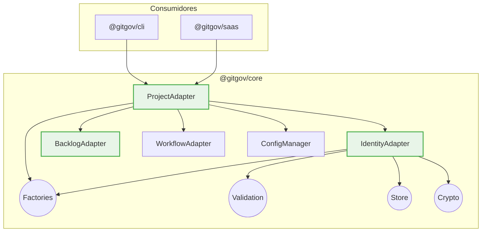

# @gitgov/core: The Governance Engine

[](https://www.npmjs.com/package/@gitgov/core)
[](https://opensource.org/licenses/MPL-2.0)
[](./tsconfig.json)

`@gitgov/core` is the **SDK** for the GitGovernance ecosystem. It provides a type-safe, local-first, and schema-driven API to manage identities, agents, tasks, and workflows in software projects.

## 🚀 Quick Start

This example shows how to create a new task using the `BacklogAdapter`. The SDK uses dependency injection - each adapter requires its dependencies to be explicitly provided.

_Note: This example assumes it is run inside an initialized GitGovernance project._

```typescript
import { Adapters, Store, EventBus } from "@gitgov/core";
import type {
  TaskRecord,
  CycleRecord,
  ActorRecord,
  AgentRecord,
} from "@gitgov/core";

// Extract classes from namespaces
const { IdentityAdapter, BacklogAdapter, WorkflowAdapter } =
  Adapters;
const { RecordStore } = Store;
const { EventBus: EventBusClass } = EventBus;

// 1. Setup core infrastructure
const eventBus = new EventBusClass();
const actorStore = new RecordStore<ActorRecord>("actors");
const agentStore = new RecordStore<AgentRecord>("agents");
const taskStore = new RecordStore<TaskRecord>("tasks");
const cycleStore = new RecordStore<CycleRecord>("cycles");

// 2. Setup identity adapter
const identity = new IdentityAdapter({
  actorStore,
  agentStore,
});

// 3. Setup workflow methodology
const workflow = WorkflowAdapter.createDefault();

// 4. Setup BacklogAdapter with minimal dependencies for basic task creation
const backlogAdapter = new BacklogAdapter({
  taskStore,
  cycleStore,
  identity,
  eventBus,
  workflowAdapter: workflow,
  // Optional dependencies (can be undefined for basic usage)
  feedbackStore: undefined,
  executionStore: undefined,
  changelogStore: undefined,
  feedbackAdapter: undefined,
  executionAdapter: undefined,
  changelogAdapter: undefined,
  metricsAdapter: undefined,
});

// 5. Create a new task
const newTaskPayload = {
  title: "Implement user authentication",
  priority: "high",
  description: "Add OAuth2 integration for Google and GitHub.",
};

const taskRecord = await backlogAdapter.createTask(
  newTaskPayload,
  "human:project-lead" // The actor performing the action
);

console.log("✅ Task Created Successfully:");
console.log({
  id: taskRecord.id,
  title: taskRecord.title,
  status: taskRecord.status, // The adapter sets the default status
});

// Expected output:
// ✅ Task Created Successfully:
// {
//   id: 'task:1727445600000-implement-user-authentication',
//   title: 'Implement user authentication',
//   status: 'draft'
// }
```

> **For production usage:** See the [complete setup example](../../blueprints/03_products/core/core_reference.md#quick-start) with all adapters and dependencies properly configured.

## ✅ What's Implemented (v1.0)

### Identity Management

- **ActorRecord**: Cryptographic identities with Ed25519 keys
- **AgentRecord**: AI agent operational manifests
- **CRUD Operations**: Create, read, list, revoke operations
- **Schema Validation**: JSON Schema-driven with detailed errors
- **Performance**: Schema validation caching

### Adapter Ecosystem (9/9 Adapters)

- **ProjectAdapter**: Project initialization engine with 3-adapter orchestration (18 tests)
- **BacklogAdapter**: Task and cycle lifecycle management with workflow validation (71 tests)
- **MetricsAdapter**: Pure calculation engine for system analytics (32 tests)
- **ChangelogAdapter**: System historian for change documentation (31 tests)
- **ExecutionAdapter**: Audit log for work execution (13 tests)
- **FeedbackAdapter**: Structured communication and blocking management (21 tests)
- **IdentityAdapter**: Cryptographic identity and agent management (25 tests)
- **WorkflowAdapter**: Configurable workflow validation engine (51 tests)
- **IndexerAdapter**: Local cache optimization for performance (5 tests)

### Record System (8/8 Records)

- **TaskRecord**: Factory and validation for task management
- **CycleRecord**: Factory and validation for cycle organization
- **ExecutionRecord**: Factory and validation for execution logging
- **ChangelogRecord**: Factory and validation for changelog generation
- **FeedbackRecord**: Factory and validation for feedback management
- **ActorRecord**: Factory and validation for identity management
- **AgentRecord**: Factory and validation for agent manifests

### Infrastructure Modules

- **Generic Store**: CRUD operations for all record types
- **Integration Testing**: Cross-module validation framework
- **WorkflowAdapter**: Configurable workflow validation engine
- **EventBusModule**: Event-driven architecture foundation with 9 event types
- **DiagramGenerator**: Automatic Mermaid diagram generation with deduplication and data quality warnings
- **Schema Generation Pipeline**: Automatic YAML→JSON→TypeScript transformation with build-time validation

## 🏗️ Architecture

The package is built with a domain-driven architecture to separate responsibilities. The public API is exposed through `Adapters`.



### Core Principles

1.  **Protocol-Driven**: The canonical JSON Schemas that define the governance protocol are bundled with the package and are the single source of truth for all data validation.
2.  **Build-Time Generation**: Schemas and types are automatically generated from YAML protocols using `npm run prebuild` (pipeline) or individual commands, ensuring 100% coherence.
3.  **Type Safety**: Strict TypeScript with no `any` to prevent compile-time errors.
4.  **Event Coherence Guarantee**: Event payloads are derived from canonical records using TypeScript Utility Types, ensuring 100% consistency between system state and system events.
5.  **Rich Errors**: Detailed, field-level validation errors to make debugging easier.
6.  **Performance**: A compiled schema cache (`SchemaValidationCache`) minimizes I/O and accelerates repetitive validations.
7.  **Local-First**: Designed to operate directly on a Git repository as its database.

## 🔧 Advanced Usage

### Schema Validation

```typescript
import {
  validateActorRecordDetailed,
  DetailedValidationError,
} from "@gitgov/core";

const result = validateActorRecordDetailed(userData);
if (!result.isValid) {
  result.errors.forEach((error) => {
    console.log(`❌ ${error.field}: ${error.message}`);
    console.log(`   Got: ${JSON.stringify(error.value)}`);
  });
}
```

### Custom Error Handling

```typescript
import {
  DetailedValidationError,
  RecordNotFoundError,
  ProjectRootError,
} from "@gitgov/core";

function handleCoreErrors(error: unknown) {
  if (error instanceof DetailedValidationError) {
    return { type: "validation", fields: error.errors };
  } else if (error instanceof RecordNotFoundError) {
    return { type: "not_found", code: error.code };
  } else if (error instanceof ProjectRootError) {
    return { type: "setup", message: "Initialize Git repository first" };
  }
  return { type: "unknown", error };
}
```

### Performance Monitoring

```typescript
import { SchemaValidationCache } from "@gitgov/core";

// Monitor cache efficiency
const stats = SchemaValidationCache.getCacheStats();
console.log(`Cache hit ratio: ${stats.cachedSchemas} schemas loaded`);

// Clear cache when schemas are updated
SchemaValidationCache.clearCache();
```

### Diagram Generation

```typescript
import { DiagramGenerator } from "@gitgov/core";

const generator = new DiagramGenerator();

// Generate Mermaid diagrams from GitGovernance records
const result = await generator.generateFromRecords(cycles, tasks, {
  cycleId: "1704067200-cycle-identity-adapter",
  layout: "TD",
  showWarnings: true,
});

console.log(result.mermaidCode);
// Automatic deduplication and data quality warnings included
```

## 🧪 Testing & Development

```bash
# Run all tests (737 tests total)
npm test
npm run test:coverage    # Run tests with coverage report

# Build-time schema and type generation
npm run sync:prompts           # Sync agent prompts for npm packaging
npm run sync:schemas           # Generate JSON schemas from YAML protocols
npm run sync:workflow-configs  # Sync workflow methodology configurations
npm run compile:types          # Generate TypeScript types from JSON schemas
npm run generate:indexes       # Generate organized export indexes
npm run validate:schemas       # Validate all generated schemas

# Development workflow
npm run prebuild         # Pipeline: sync:prompts → compile:types → generate:indexes
npm run build           # Clean build with TypeScript compilation
npm run clean           # Remove dist directory
npm run clean:generated # Remove all generated schemas and types

# Type checking
npx tsc --noEmit

# Watch mode for development
npm test -- --watch
```

### Test Coverage

- **737 tests total** with EARS methodology
- **ProjectAdapter**: 18 tests (project initialization + template processing + error recovery)
- **BacklogAdapter**: 71 tests (workflow lifecycle + event handlers + E2E simulation + deduplication)
- **MetricsAdapter**: 32 tests (Tier 1+2 calculations + performance validation)
- **ChangelogAdapter**: 31 tests (multi-entity changelog + conditional validation)
- **EventBusModule**: 32 tests (20 unit + 12 integration tests with cross-adapter scenarios)
- **FeedbackAdapter**: 21 tests (EARS coverage with dual event emission + duplicate assignment prevention)
- **ExecutionAdapter**: 13 tests (EARS coverage with performance validation)
- **WorkflowAdapter**: 51 tests (29 unit + 22 integration tests)
- **Identity Domain**: 66 tests (Adapter + ActorRecord/AgentRecord factories & validators)
- **Validation**: 62 tests (for Task, Cycle, Exec, CL, Feedback records + schema caching)
- **Factories**: 40 tests (for Task, Cycle, Exec, CL, Feedback records)
- **Store**: 26 tests (generic CRUD for all record types)
- **Crypto**: 23 tests (signatures + checksums for all 7 record types)
- **ConfigManager**: 20 tests (configuration + session state + project utilities)
- **IndexerAdapter**: 5 tests (cache generation, validation, and retrieval)
- **Utils**: 10 tests (ID generation utilities)
- **Integration**: 74 tests (cross-module validation)

## 📋 Roadmap

### Next Steps

- **Git Adapter**: Development of a low-level adapter for direct Git operations.
- **Platform Adapters**: Integration with platform-specific features (e.g., GitHub Adapter).
- **Advanced Validation**: Creation of `lint` and `audit` modules for structural and protocol validation.

### Recently Completed

- **Adapter Ecosystem**: All 9 core adapters for the foundational domains have been implemented and tested.
- **IndexerAdapter**: A dedicated module for local cache optimization to enhance performance is now available.
- **EventBusModule**: The foundational event-driven architecture is in place, enabling decoupled communication between modules.
- **ProjectAdapter**: The project initialization and orchestration logic is functional.
- **DiagramGenerator Module**: Automatic Mermaid diagram generation with deduplication, data quality warnings, and advanced filtering.
- **Schema Generation Pipeline**: YAML→JSON→TypeScript build-time transformation with automatic synchronization.

## Contributing

Contributions are welcome.

- For local development, see **Testing & Development** above.
- Please open issues for bugs/feature requests and include reproduction steps.
- Run `npm test` and `npm run build` before submitting PRs.

## Security

If you believe you've found a security issue, please report it responsibly via a private channel (or GitHub Security Advisories if enabled) before opening a public issue.

## Community

- **GitHub Discussions:** Questions, ideas, and architecture discussions
- **Discord:** Community chat
- **Twitter/X:** Project updates

## License

This package (**@gitgov/core**) is licensed under the **Mozilla Public License 2.0 (MPL-2.0)**.

## Links

- **GitHub:** https://github.com/gitgovernance
- **NPM:** https://www.npmjs.com/package/@gitgov/core
- **Blueprints:** https://github.com/gitgovernance/monorepo/tree/main/packages/blueprints

---

Built with ❤️ by the GitGovernance team.
