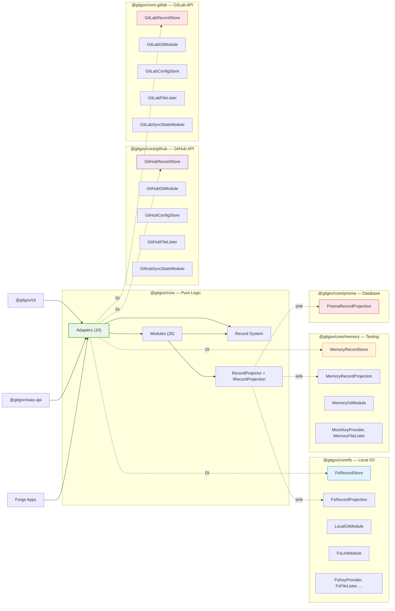

# @gitgov/core: The Governance Engine

[](https://www.npmjs.com/package/@gitgov/core)
[](https://opensource.org/licenses/MPL-2.0)
[](./tsconfig.json)

`@gitgov/core` is the **SDK** for the GitGovernance ecosystem. It provides a type-safe, local-first, and schema-driven API to manage identities, agents, tasks, and workflows in software projects.

## Install

```bash
pnpm add @gitgov/core
```

## Quick Start

The SDK uses dependency injection. Each adapter receives its dependencies via constructor.

### Filesystem Backend (CLI, local development)

```typescript
import { Adapters, Store, EventBus } from '@gitgov/core';
import { FsRecordStore } from '@gitgov/core/fs';
import type { TaskRecord, CycleRecord, ActorRecord, AgentRecord } from '@gitgov/core';

// Infrastructure
const eventBus = new EventBus.EventBus();
const taskStore = new FsRecordStore<TaskRecord>({ recordType: 'tasks', projectRoot: '.' });
const cycleStore = new FsRecordStore<CycleRecord>({ recordType: 'cycles', projectRoot: '.' });
const actorStore = new FsRecordStore<ActorRecord>({ recordType: 'actors', projectRoot: '.' });
const agentStore = new FsRecordStore<AgentRecord>({ recordType: 'agents', projectRoot: '.' });

// Adapters compose modules
const identity = new Adapters.IdentityAdapter({ actorStore, agentStore });
const workflow = Adapters.WorkflowAdapter.createDefault();
const backlog = new Adapters.BacklogAdapter({
  taskStore, cycleStore, identity, eventBus, workflowAdapter: workflow,
});

// Create a task
const task = await backlog.createTask(
  { title: 'Implement auth', priority: 'high' },
  'human:project-lead',
);
```

### GitHub API Backend

For SaaS, Forge apps, or GitHub Actions — no filesystem needed:

```typescript
import { Octokit } from '@octokit/rest';
import {
  GitHubRecordStore,
  GitHubConfigStore,
  GitHubGitModule,
  GitHubFileLister,
} from '@gitgov/core/github';
import type { TaskRecord } from '@gitgov/core';

const octokit = new Octokit({ auth: process.env.GITHUB_TOKEN });
const repoOpts = { owner: 'my-org', repo: 'my-repo', basePath: '.gitgov/tasks' };

const taskStore = new GitHubRecordStore<TaskRecord>(repoOpts, octokit);

// Read — returns parsed JSON, caches SHA for subsequent writes
const task = await taskStore.get('task-001');

// Write — returns { commitSha } from the created commit
const result = await taskStore.put('task-002', newTask);

// Atomic batch — single commit for N records (requires GitHubGitModule)
const gitModule = new GitHubGitModule({ owner: 'my-org', repo: 'my-repo' }, octokit);
const batchStore = new GitHubRecordStore<TaskRecord>(repoOpts, octokit, gitModule);
await batchStore.putMany([
  { id: 'task-003', value: task3 },
  { id: 'task-004', value: task4 },
]);
```

## Architecture


```mermaid
graph LR
    subgraph "@gitgov/core — Pure Logic"
        Adapters["Adapters (10)"]
        Modules["Modules (26)"]
        Records["Record System"]
        Projection["RecordProjector + IRecordProjection"]

        Adapters --> Modules
        Adapters --> Records
        Modules --> Records
        Modules --> Projection
    end

    subgraph "@gitgov/core/fs — Local I/O"
        FsStore["FsRecordStore"]
        FsProjection["FsRecordProjection"]
        FsGit["LocalGitModule"]
        FsLint["FsLintModule"]
        FsOther["FsKeyProvider, FsFileLister, ..."]
    end

    subgraph "@gitgov/core/github — GitHub API"
        GhStore["GitHubRecordStore"]
        GhGit["GitHubGitModule"]
        GhConfig["GitHubConfigStore"]
        GhFiles["GitHubFileLister"]
        GhSync["GithubSyncStateModule"]
    end

    subgraph "@gitgov/core/memory — Testing"
        MemStore["MemoryRecordStore"]
        MemProjection["MemoryRecordProjection"]
        MemGit["MemoryGitModule"]
        MemOther["MockKeyProvider, MemoryFileLister"]
    end

    subgraph "@gitgov/core/prisma — Database"
        PrismaProjection["PrismaRecordProjection"]
    end

    subgraph "@gitgov/core-gitlab — GitLab API"
        GlStore["GitLabRecordStore"]
        GlGit["GitLabGitModule"]
        GlConfig["GitLabConfigStore"]
        GlFiles["GitLabFileLister"]
        GlSync["GitLabSyncStateModule"]
    end

    Adapters -.->|DI| FsStore
    Adapters -.->|DI| GhStore
    Adapters -.->|DI| GlStore
    Adapters -.->|DI| MemStore
    Projection -.->|sink| FsProjection
    Projection -.->|sink| MemProjection
    Projection -.->|sink| PrismaProjection

    CLI["@gitgov/cli"] --> Adapters
    SaaS["@gitgov/saas-api"] --> Adapters
    Forge["Forge Apps"] --> Adapters

    style Adapters fill:#e8f5e8,stroke:#4caf50,stroke-width:2px
    style FsStore fill:#e3f2fd,stroke:#1976d2
    style GhStore fill:#f3e5f5,stroke:#7b1fa2
    style GlStore fill:#fce4ec,stroke:#e65100
    style MemStore fill:#fff3e0,stroke:#f57c00
    style PrismaProjection fill:#fce4ec,stroke:#c62828
```

### 7 Import Paths

| Import | Contents | I/O |
|--------|----------|-----|
| `@gitgov/core` | Interfaces, types, pure logic, factories, validators + all audit types | No |
| `@gitgov/core/audit` | Audit product types: Finding, Waiver, Scan, PolicyDecision, enums, metadata types | No |
| `@gitgov/core/fs` | Filesystem implementations (FsRecordStore, FsRecordProjection, LocalGitModule, FsLintModule, ...) | Local |
| `@gitgov/core/github` | GitHub API implementations (GitHubRecordStore, GitHubGitModule, GitHubConfigStore, GitHubFileLister, GithubSyncStateModule, GithubWebhookHandler) | Remote |
| `@gitgov/core-gitlab` | GitLab API implementations — [separate package](https://gitlab.com/gitgovernance/core-gitlab) | Remote |
| `@gitgov/core/memory` | In-memory implementations for testing (MemoryRecordStore, MemoryRecordProjection, MemoryGitModule, ...) | No |
| `@gitgov/core/prisma` | Database-backed implementations via Prisma-compatible client (PrismaRecordProjection) | Remote |

The root import (`@gitgov/core`) re-exports everything from `@gitgov/core/audit`. Both paths provide the same types.

### Audit Product Types (`@gitgov/core/audit`)

The Audit product defines canonical types derived from protocol records. **All consumers MUST import these from core — never redefine locally.**

```typescript
import type {
  // Core finding type — one type everywhere, no "ConsolidatedFinding"
  Finding,
  // Waiver — materialized from FeedbackRecord(type: "approval")
  Waiver, WaiverMetadata,
  // Scan — groups ExecutionRecords from one audit run
  Scan,
  // Policy decision — stored in ExecutionRecord(type: "decision")
  PolicyDecision,
  // Enums — use these, never bare `string`
  FindingSeverity,     // "critical" | "high" | "medium" | "low"
  FindingCategory,     // "pii-email" | "hardcoded-secret" | ...
  DetectorName,        // "regex" | "heuristic" | "llm"
  WaiverStatus,        // "active" | "expired" | "revoked"
  FindingStatus,       // "new" | "in_progress" | "waived" | "resolved"
  ScanDisplayStatus,   // "success" | "partial" | "blocked"
  PolicyStatus,        // "pass" | "block"
  ScanScope,           // "full" | "diff"
  // Metadata types — use with record generics
  SarifExecutionMetadata,    // for ExecutionRecord<SarifExecutionMetadata>
  PolicyExecutionMetadata,   // for ExecutionRecord<PolicyExecutionMetadata>
  GitHubActorMetadata,       // for ActorRecord<GitHubActorMetadata>
  // Lifecycle events
  FindingHistoryEvent,
  WaiverLifecycleEvent,
} from '@gitgov/core/audit';  // or from '@gitgov/core'
```

### Record Generics

All records accept a metadata type parameter via `<TMetadata>`:

```typescript
import type { GitGovExecutionRecord, GitGovActorRecord } from '@gitgov/core';
import type { SarifExecutionMetadata, GitHubActorMetadata } from '@gitgov/core';

// Typed metadata — no more `as { kind?: string; data?: SarifLog }`
type SarifExecution = GitGovExecutionRecord<SarifExecutionMetadata>;
type GitHubActor = GitGovActorRecord<GitHubActorMetadata>;
```

The generics flow from protocol schemas:
```
YAML schema (additionalProperties: true on metadata)
  → compile:types generates Record<TMetadata = object>
    → GitGovRecordPayload<TMetadata> accepts the generic
      → EmbeddedMetadataRecord wraps with header + payload
        → GitGov*Record<TMetadata> passes through
```

### Rules for Consumers

Packages that depend on `@gitgov/core` (CLI, saas-api, saas-web, agents, MCP server) MUST follow these rules:

1. **Import from core, never redefine.** If `Finding` exists in core, import it. Don't create `type Finding = { ... }` locally.
2. **Use enums, never `string`.** Write `severity: FindingSeverity`, not `severity: string`.
3. **No `as any`, no `as unknown as`.** If you need a cast, the type is wrong — fix it or add the type to core.
4. **No `as { ... }` inline types.** If you cast `metadata as { kind?: string }`, use `SarifExecutionMetadata` from core instead.
5. **If a type doesn't exist in core, add it to core.** Don't invent it locally — it will drift.

### Record Symmetry

Every record type has 4 parallel artifacts:

| Artifact | Directory | Responsibility |
|----------|-----------|----------------|
| Types | `record_types/generated/` | Shape of the record (generated from schema) |
| Factory | `record_factories/` | Create record with defaults + validation |
| Validator | `record_validations/` | Business rules on the record |
| Schema | `record_schemas/generated/` | JSON Schema for AJV validation |

The 6 records: **Actor, Agent, Task, Cycle, Execution, Feedback**

## Adapters

Adapters are orchestrators that compose modules. All receive dependencies via constructor injection.

| Adapter | Purpose |
|---------|---------|
| `ProjectAdapter` | Project initialization, environment validation |
| `IdentityAdapter` | Actor and agent identity management |
| `BacklogAdapter` | Task and cycle lifecycle, workflow validation |
| `ExecutionAdapter` | Execution audit log tracking |
| `FeedbackAdapter` | Structured feedback and blocking resolution |
| `MetricsAdapter` | System status and productivity metrics |
| `IndexerAdapter` | Local cache generation and integrity checks |
| `WorkflowAdapter` | State transitions with signatures and custom rules |
| `AgentAdapter` | Agent lifecycle management |

## Modules

| Module | Responsibility |
|--------|----------------|
| `record_types/` | TypeScript types per record (generated from schemas) |
| `record_factories/` | Factories with defaults for creating records |
| `record_validations/` | Business validators (above schema) |
| `record_schemas/` | JSON Schemas + schema cache + errors |
| `record_store/` | `RecordStore<V, R, O>` interface (impl in fs/memory/github) |
| `record_projection/` | `IRecordProjection` interface + RecordProjector engine (drivers: fs/memory/prisma) |
| `record_metrics/` | RecordMetrics calculation engine (system status, productivity, collaboration) |
| `config_store/` | Storage for project config.json (impl in fs/github) |
| `config_manager/` | Typed access to config.json (versioned in git) |
| `session_store/` | Storage for .session.json |
| `session_manager/` | Typed access to .session.json (ephemeral, not versioned) |
| `sync_state/` | Push/pull/resolve synchronization (FsWorktreeSyncStateModule, GithubSyncStateModule, GithubWebhookHandler, PullScheduler) |
| `record_projection/` | RecordProjector engine — generates IndexData, persists to sinks (FS, Prisma, Memory) |
| `sarif/` | SarifBuilder — generates SARIF 2.1.0 with content-based fingerprints, suppressions, validation |
| `git/` | `IGitModule` interface + local/memory implementations |
| `crypto/` | Checksums, digital signatures, verification |
| `key_provider/` | Key storage abstraction (fs/memory) |
| `file_lister/` | File listing abstraction (fs/memory) |
| `lint/` | Structural + referential validation |
| `event_bus/` | Typed pub/sub with 9 event types |
| `agent_runner/` | Agent execution (interface + loader) |
| `watcher_state/` | File change tracking in .gitgov/ |
| `project_initializer/` | GitGovernance project setup |
| `finding_detector/` | Finding detection (regex, heuristic, LLM) |
| `source_auditor/` | Cross-system audit (code, Jira, gitgov) |
| `sarif/` | SARIF 2.1.0 builder, hash, validation (42 EARS) |
| `audit_orchestrator/` | Multi-agent audit orchestration, SARIF consolidation, waiver application (10 EARS) |
| `policy_evaluator/` | Pass/block evaluation by severity threshold (stub — Epic 5 formalizes) |
| `diagram_generator/` | Mermaid diagram generation |
| `logger/` | Centralized logging |
| `utils/` | ID generation/parsing, array utils, signature utils |

## Development

```bash
# Type check
pnpm tsc --noEmit

# Build (full pipeline: schemas + types + tsup)
pnpm build

# Tests
pnpm test
pnpm test:coverage
```

### Build Pipeline

```
YAML schemas -> JSON schemas (AJV) -> TypeScript types (generated/)
```

Individual steps:

```bash
pnpm sync                  # Sync from blueprints (schemas, configs, prompts)
pnpm compile:types         # JSON -> TypeScript
pnpm generate:indexes      # Generate barrel exports
pnpm validate:schemas      # Validate all schemas
pnpm prebuild              # compile:types + generate:indexes
```

Never edit files in `generated/`. Modify the source schema and regenerate.

## License

This package is licensed under the [Mozilla Public License 2.0 (MPL-2.0)](https://opensource.org/licenses/MPL-2.0).

## Links

- **GitHub:** https://github.com/gitgovernance/monorepo/tree/main/packages/core
- **NPM:** https://www.npmjs.com/package/@gitgov/core

---

**Built with ❤️ by the GitGovernance team.**
