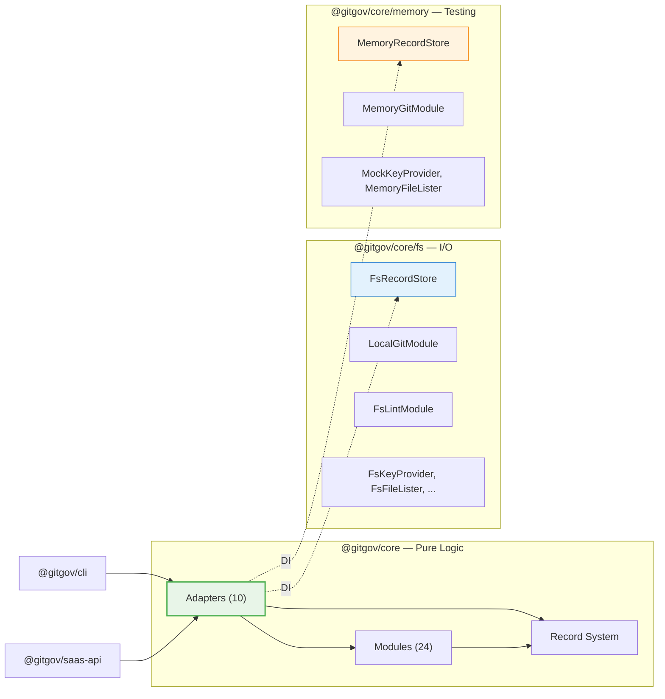

# @gitgov/core: The Governance Engine

[](https://www.npmjs.com/package/@gitgov/core)
[](https://opensource.org/licenses/MPL-2.0)
[](./tsconfig.json)

`@gitgov/core` is the **SDK** for the GitGovernance ecosystem. It provides a type-safe, local-first, and schema-driven API to manage identities, agents, tasks, and workflows in software projects.

## Install

```bash
pnpm add @gitgov/core
```

## Quick Start

The SDK uses dependency injection. Each adapter receives its dependencies via constructor.

```typescript
import { Adapters, Store, EventBus } from '@gitgov/core';
import { FsRecordStore } from '@gitgov/core/fs';
import type { TaskRecord, CycleRecord, ActorRecord, AgentRecord } from '@gitgov/core';

// Infrastructure
const eventBus = new EventBus.EventBus();
const taskStore = new FsRecordStore<TaskRecord>({ recordType: 'tasks', projectRoot: '.' });
const cycleStore = new FsRecordStore<CycleRecord>({ recordType: 'cycles', projectRoot: '.' });
const actorStore = new FsRecordStore<ActorRecord>({ recordType: 'actors', projectRoot: '.' });
const agentStore = new FsRecordStore<AgentRecord>({ recordType: 'agents', projectRoot: '.' });

// Adapters compose modules
const identity = new Adapters.IdentityAdapter({ actorStore, agentStore });
const workflow = Adapters.WorkflowAdapter.createDefault();
const backlog = new Adapters.BacklogAdapter({
  taskStore, cycleStore, identity, eventBus, workflowAdapter: workflow,
});

// Create a task
const task = await backlog.createTask(
  { title: 'Implement auth', priority: 'high' },
  'human:project-lead',
);
```

## Architecture



### 3 Export Paths

| Import | Contents | I/O |
|--------|----------|-----|
| `@gitgov/core` | Interfaces, types, pure logic, factories, validators | No |
| `@gitgov/core/fs` | Filesystem implementations (FsRecordStore, LocalGitModule, FsLintModule, ...) | Yes |
| `@gitgov/core/memory` | In-memory implementations for testing (MemoryRecordStore, MemoryGitModule, ...) | No |

The root import (`@gitgov/core`) never imports `fs`, `path`, or `child_process`.

### Record Symmetry

Every record type has 4 parallel artifacts:

| Artifact | Directory | Responsibility |
|----------|-----------|----------------|
| Types | `record_types/generated/` | Shape of the record (generated from schema) |
| Factory | `record_factories/` | Create record with defaults + validation |
| Validator | `record_validations/` | Business rules on the record |
| Schema | `record_schemas/generated/` | JSON Schema for AJV validation |

The 8 records: **Actor, Agent, Task, Cycle, Execution, Changelog, Feedback, Workflow**

## Adapters

Adapters are orchestrators that compose modules. All receive dependencies via constructor injection.

| Adapter | Purpose |
|---------|---------|
| `ProjectAdapter` | Project initialization, environment validation |
| `IdentityAdapter` | Actor and agent identity management |
| `BacklogAdapter` | Task and cycle lifecycle, workflow validation |
| `ExecutionAdapter` | Execution audit log tracking |
| `FeedbackAdapter` | Structured feedback and blocking resolution |
| `ChangelogAdapter` | Automatic changelog entries |
| `MetricsAdapter` | System status and productivity metrics |
| `IndexerAdapter` | Local cache generation and integrity checks |
| `WorkflowAdapter` | State transitions with signatures and custom rules |
| `AgentAdapter` | Agent lifecycle management |

## Modules

| Module | Responsibility |
|--------|----------------|
| `record_types/` | TypeScript types per record (generated from schemas) |
| `record_factories/` | Factories with defaults for creating records |
| `record_validations/` | Business validators (above schema) |
| `record_schemas/` | JSON Schemas + schema cache + errors |
| `record_store/` | `RecordStore<T>` interface (impl in fs/memory) |
| `config_store/` | Storage for project config.json |
| `config_manager/` | Typed access to config.json (versioned in git) |
| `session_store/` | Storage for .session.json |
| `session_manager/` | Typed access to .session.json (ephemeral, not versioned) |
| `sync_state/` | Push/pull/resolve synchronization state |
| `git/` | `IGitModule` interface + local/memory implementations |
| `crypto/` | Checksums, digital signatures, verification |
| `key_provider/` | Key storage abstraction (fs/memory) |
| `file_lister/` | File listing abstraction (fs/memory) |
| `lint/` | Structural + referential validation |
| `event_bus/` | Typed pub/sub with 9 event types |
| `agent_runner/` | Agent execution (interface + loader) |
| `watcher_state/` | File change tracking in .gitgov/ |
| `project_initializer/` | GitGovernance project setup |
| `finding_detector/` | Finding detection (regex, heuristic, LLM) |
| `source_auditor/` | Cross-system audit (code, Jira, gitgov) |
| `diagram_generator/` | Mermaid diagram generation |
| `logger/` | Centralized logging |
| `utils/` | ID generation/parsing, array utils, signature utils |

## Development

```bash
# Type check
pnpm tsc --noEmit

# Build (full pipeline: schemas + types + tsup)
pnpm build

# Tests
pnpm test
pnpm test:coverage
```

### Build Pipeline

```
YAML schemas -> JSON schemas (AJV) -> TypeScript types (generated/)
```

Individual steps:

```bash
pnpm sync                  # Sync from blueprints (schemas, configs, prompts)
pnpm compile:types         # JSON -> TypeScript
pnpm generate:indexes      # Generate barrel exports
pnpm validate:schemas      # Validate all schemas
pnpm prebuild              # compile:types + generate:indexes
```

Never edit files in `generated/`. Modify the source schema and regenerate.

## License

This package is licensed under the [Mozilla Public License 2.0 (MPL-2.0)](https://opensource.org/licenses/MPL-2.0).

## Links

- **GitHub:** https://github.com/gitgovernance/monorepo/tree/main/packages/core
- **NPM:** https://www.npmjs.com/package/@gitgov/core

---

**Built with ❤️ by the GitGovernance team.**
