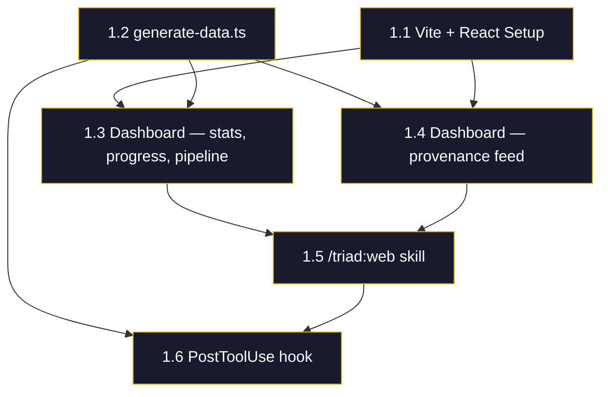
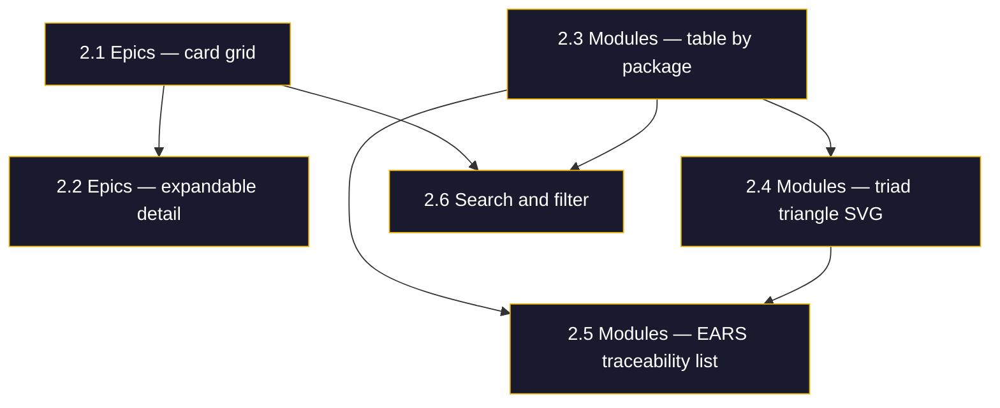
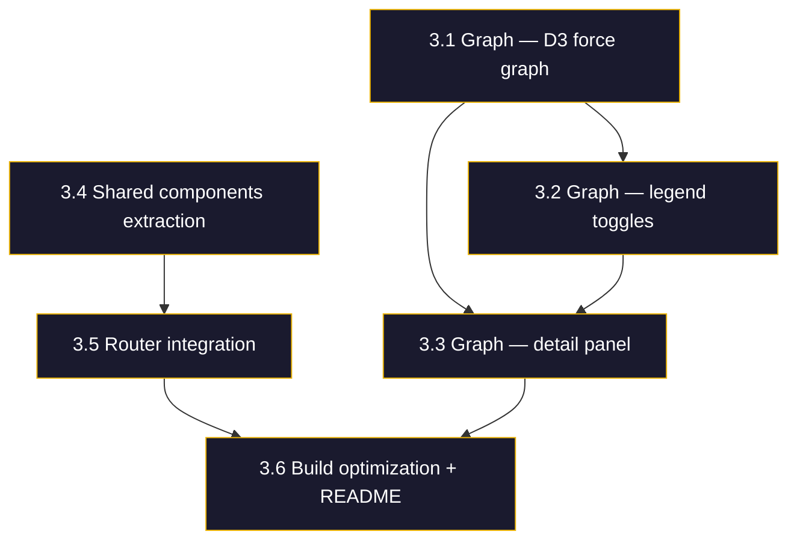

# triad_web — Roadmap

> **Fuente de verdad del progreso: este documento.**
> Para contexto de origen ver [`inputs/epic_input.md`](./inputs/epic_input.md).
> Para contexto de conversacion ver [`inputs/conversation_context.md`](./inputs/conversation_context.md).

---

## Resumen de Cycles

| Cycle | Nombre | Objetivo | Packages | Estado |
|---:|---|---|---|:---:|
| 1 | Foundation + Dashboard | Setup Vite + React, data generation script, Dashboard page, /triad:web skill | `packages/claude-plugins/plugins/triad/web/` | 🟢 Completado |
| 2 | Epics + Modules | Epics page con expandable cards, Modules page con package grouping y triad triangle | `packages/claude-plugins/plugins/triad/web/` | 🟢 Completado |
| 3 | Graph + Polish | D3 force graph migrado a React, shared components, routing, build optimization | `packages/claude-plugins/plugins/triad/web/` | 🟡 En Progreso |

---

## Specs Requeridos

| Spec | Tipo | Cycle | Path | Estado |
|---|---|---:|---|:---:|
| `generate_data` | module | 1 | `web/scripts/generate-data.ts` | 🟢 Implementado (12 EARS, 12 tests) |
| `dashboard_page` | view | 1 | `web/src/views/dashboard/DashboardView.tsx` | 🟡 Parcial (conectado a generate-data, falta audit) |
| `web_skill` | skill | 1 | `skills/web/SKILL.md` | 🟢 Implementado (7 EARS, spec + SKILL.md) |
| `epics_view` | view | 2 | `web/src/views/epics/EpicsView.tsx` | 🟢 Implementado (14 EARS, 14 tests) |
| `modules_view` | view | 2 | `web/src/views/modules/ModulesView.tsx` | 🟢 Implementado (14 EARS, 15 tests) |
| `graph_view` | view | 3 | `web/src/views/graph/GraphView.tsx` | 🟢 Implementado (19 EARS, 16 tests) |
| `git_hook` | module | 3 | `web/scripts/install-git-hook.ts` | 🟢 Implementado (8 EARS, 8 tests) |
| `shared_components` | module | 3 | `web/src/shared/` | 🔴 Pendiente |

---

## Flujo de Trabajo por Cycle

> **REGLA:** Para CADA cycle, seguir este orden estrictamente.

```
1. VERIFICAR SPECS
   └── Ver tabla "Specs Requeridos" para el cycle
   └── Si hay Pendiente → CREAR SPEC antes de codificar

2. IMPLEMENTAR
   └── Codigo segun EARS del spec

3. TESTS
   └── Cada EARS debe tener al menos un test

4. AUDITAR
   └── /triad:audit

5. MARCAR COMPLETADO
   └── Actualizar este roadmap
```

---

# Cycle 1: Foundation + Dashboard

## Objetivo

Setup del proyecto Vite + React, crear el script de generacion de datos que lee `.triad/state/` y roadmaps, implementar la pagina Dashboard con stats, epic progress, module pipeline y provenance feed, y crear el skill `/triad:web` que orquesta todo.

## Modulos a Implementar

| Modulo | Tipo | Descripcion | Dependencias |
|:-------|:-----|:------------|:-------------|
| `generate_data` | module | Script que lee `.triad/state/*.json` + `specs/epics/*/roadmap.md` y genera `web/src/data/state.json` | `state_manager.getEpicSummary()` |
| `dashboard_page` | view | Dashboard page: stats row, epic progress table, module state machine pipeline, provenance feed | `generate_data` (consume state.json) |
| `web_skill` | skill | `/triad:web` skill que genera datos, builds, sirve y abre browser | `generate_data`, `dashboard_page` |

---

## Criterios de Aceptacion

### Task 1.1: Vite + React project setup

- [x] `web/package.json` con dependencias: react 19, vite 8, typescript 5.8
- [x] `web/vite.config.ts` con configuracion de dev server (port 4173)
- [x] `web/tsconfig.json` con strict mode
- [x] `web/index.html` como entry point de Vite con JetBrains Mono + Inter fonts
- [x] `web/src/main.tsx` con React root render
- [x] `web/src/App.tsx` con sidebar navigation + page routing (state-based)
- [x] Brand guide aplicado: lib/tokens.css con dark mode, gold accent, fonts
- [x] `dist/` y `src/data/state.json` en `.gitignore`

**EARS — Requisitos Formales:**

| ID | Tipo | Requisito |
|:---|:-----|:----------|
| TW-A1 | EVENT | WHEN `npm run dev` is executed in the web directory, the system SHALL start a Vite dev server serving the React application. |
| TW-A2 | EVENT | WHEN `npm run build` is executed, the system SHALL produce a static `dist/` bundle with HTML, JS, and CSS. |
| TW-A3 | STATE | WHILE the application is rendered, the layout SHALL display a sidebar with navigation links and a main content area. |
| TW-A4 | STATE | WHILE the application is rendered, the visual styling SHALL follow the brand guide: dark background (#0a0a0a), gold accent (#eab308), JetBrains Mono for code, Inter for body text, no shadows, no gradients. |

---

### Task 1.2: generate-data.ts

- [x] Script reads `.triad/state.json` (epic registry index)
- [x] Script reads `.triad/state/{epic}/*.json` (module state files)
- [ ] Script parses `specs/epics/*/roadmap.md` for cycle/task/EARS counts
- [x] Output: `web/src/data/state.json` matching `TriadWebData` interface
- [x] Computes per-epic: task progress %, cycle counts, EARS counts, module counts by state
- [x] Computes per-module: state, EARS count, score, last transition, history
- [ ] Builds graph nodes/edges from state relationships
- [x] Accepts `projectRoot` argument (defaults to `process.cwd()`)
- [x] Handles missing `.triad/` gracefully (generates empty state with warning)

**EARS — Requisitos Formales:**

| ID | Tipo | Requisito |
|:---|:-----|:----------|
| TW-A5 | EVENT | WHEN `generate-data.ts` is executed with a valid project root, the system SHALL read `.triad/state.json` and all module state files under `.triad/state/{epic}/`. |
| TW-A6 | EVENT | WHEN `generate-data.ts` is executed, the system SHALL parse `specs/epics/*/roadmap.md` files to extract cycle, task, and EARS counts. |
| TW-A7 | RESPONSE | WHEN data generation completes, the system SHALL write a `state.json` file to `web/src/data/` with the `TriadWebData` schema. |
| TW-A8 | UNWANTED | IF `.triad/` directory does not exist, the system SHALL generate an empty state structure with a warning message instead of throwing an error. |
| TW-A9 | STATE | WHILE module state files exist, the generated output SHALL include per-module fields: state, EARS count, score, last transition, and full history. |
| TW-A10 | STATE | WHILE epic data exists, the generated output SHALL include per-epic fields: task progress percentage, cycle counts, EARS counts, and module counts grouped by state. |

---

### Task 1.3: Dashboard page — stats row, epic progress, module pipeline

- [ ] Stats row: Triad Score (org average), Active Epics count, Modules Tracked count, EARS Coverage %
- [ ] Epic progress table: name, status badge, cycle indicator, task progress bar, score
- [ ] Module state machine pipeline: horizontal bar showing count per state (no_spec → spec_draft → spec_ready → implemented → tested → coherent), colored segments
- [ ] Responsive layout, consistent with brand guide
- [ ] All data sourced from imported `state.json`

**EARS — Requisitos Formales:**

| ID | Tipo | Requisito |
|:---|:-----|:----------|
| TW-A11 | STATE | WHILE the Dashboard page is rendered, it SHALL display a stats row with: Triad Score (org average), Active Epics count, Modules Tracked count, and EARS Coverage percentage. |
| TW-A12 | STATE | WHILE epic data exists, the Dashboard SHALL display an epic progress table with columns: name, status badge, active cycle, task progress bar, and triad score. |
| TW-A13 | STATE | WHILE module data exists, the Dashboard SHALL display a state machine pipeline visualization showing the count of modules in each of the 7 states as colored segments. |
| TW-A14 | UNWANTED | IF state.json contains zero epics, the Dashboard SHALL display an empty state message instead of rendering broken tables. |

---

### Task 1.4: Dashboard page — provenance feed

- [ ] Provenance feed section: last 5 state transitions across all modules
- [ ] Each entry: timestamp, module name, from → to states, trigger, epic name
- [ ] Sorted by most recent first
- [ ] Clickable entries (future: link to module detail)

**EARS — Requisitos Formales:**

| ID | Tipo | Requisito |
|:---|:-----|:----------|
| TW-A15 | STATE | WHILE transition history exists, the Dashboard SHALL display a provenance feed showing the 5 most recent state transitions across all modules, sorted by timestamp descending. |
| TW-A16 | STATE | WHILE a provenance entry is displayed, it SHALL include: timestamp, module name, from-state, to-state, trigger, and epic name. |

---

### Task 1.5: /triad:web skill spec + SKILL.md

- [ ] SKILL.md follows skill_designer format
- [ ] Step 1: Verify `.triad/` exists (suggest `/triad:init` if missing)
- [ ] Step 2: Execute `generate-data.ts` to produce `state.json`
- [ ] Step 3: Build if `dist/` does not exist (`vite build`)
- [ ] Step 4: Serve via `vite preview` and open browser
- [ ] Skill is read-only (never modifies state files or source code)

**EARS — Requisitos Formales:**

| ID | Tipo | Requisito |
|:---|:-----|:----------|
| TW-A17 | EVENT | WHEN `/triad:web` is invoked, the system SHALL verify that `.triad/` directory exists and suggest `/triad:init` if it does not. |
| TW-A18 | EVENT | WHEN `/triad:web` executes, the system SHALL run `generate-data.ts` to produce a fresh `state.json` before serving. |
| TW-A19 | EVENT | WHEN `dist/` does not exist, the system SHALL run `vite build` before starting the preview server. |
| TW-A20 | EVENT | WHEN the build is ready, the system SHALL start `vite preview` and open the default browser to the local URL. |

---

### Task 1.6: PostToolUse hook integration

- [ ] PostToolUse hook detects writes to `.triad/state/` paths
- [ ] On detected change, hook re-executes `generate-data.ts` automatically
- [ ] Vite HMR picks up `state.json` change and hot-reloads in browser
- [ ] Throttled to avoid rapid re-generation (debounce 1 second)

**EARS — Requisitos Formales:**

| ID | Tipo | Requisito |
|:---|:-----|:----------|
| TW-A21 | EVENT | WHEN a PostToolUse hook detects a write to any file under `.triad/state/`, the system SHALL re-execute `generate-data.ts` to refresh `state.json`. |
| TW-A22 | UNWANTED | IF multiple `.triad/` writes occur within 1 second, the system SHALL debounce and execute `generate-data.ts` only once after the burst. |

---

### Cycle 1 Dependency Diagram



---

### Task 1.7: Mejora de /triad:impl — methodology loading (no prevista)

> **Nota:** Al implementar el dashboard, se descubrio que /triad:impl no inyectaba la metodologia frontend. El agente escribio codigo sin seguir la estructura views/shared/lib. Se agrego Paso 2.5 al SKILL.md.

- [x] Paso 2.5 agregado a skills/impl/SKILL.md: carga methodology.md (base) + frontend_methodology.md (views)
- [x] Tabla de extensiones por tipo (view, module, agent, cli)
- [x] 5 reglas de frontend explicitadas en el skill
- [x] Regla bloqueante: "NUNCA generar codigo sin haber leido la metodologia"

### Task 1.8: Setup de infraestructura Triad en worktree (no prevista)

> **Nota:** El worktree no tenia .triad/ configurado. Sin hooks ni state machine, no habia enforcement.

- [x] .triad/config.json creado en worktree (stateMachine enabled, specsDir configurado)
- [x] Deuda tecnica registrada en AGENTS.md (skills sin E2E tests)

### Task 1.9: Creacion de spec dashboard_view (no prevista como task separada)

> **Nota:** El roadmap listaba dashboard_page como spec requerido pero no tenia task explicita para crear el spec. Se creo usando /triad:new spec --type view.

- [x] specs/views/dashboard/dashboard_view.md creado (16 EARS, 5 bloques)
- [x] specs/views/dashboard/dashboard_brief.md creado (5 data sources)

### Task 1.10: Spec + impl + audit de generate_data (no prevista como task separada)

> **Nota:** generate_data estaba en Task 1.2 como checkboxes pero necesitaba spec formal antes de implementar (metodologia triad). Se creo spec, se implemento, se audito, se fixeo.

- [x] specs/modules/generate_data/generate_data_module.md creado (12 EARS, 4 bloques)
- [x] scripts/generate-data.ts implementado (7 funciones, 12 EARS trazados)
- [x] scripts/generate-data.test.ts implementado (12 tests, todos REAL)
- [x] /triad:audit generate_data ejecutado (5 auditors, 9 findings)
- [x] /triad:fix aplicado (4 tests mejorados, 3 spec updates)
- [x] Audited: 12/12 EARS coherent

### Task 1.11: Mejoras a AGENTS.md y /triad:impl (no prevista)

> **Nota:** Durante impl de generate_data se descubrio que /triad:impl no lee AGENTS.md del package target, causando que `interface` se usara en vez de `type`. Se mejoraron 3 archivos.

- [x] triad/AGENTS.md: seccion Convenciones ampliada (type vs interface, frontend rules)
- [x] triad/AGENTS.md: deuda tecnica registrada (/triad:impl no lee AGENTS.md)
- [x] skills/impl/SKILL.md: Paso 2.5 mejorado (methodology.md base + extension por tipo)
- [x] skills/impl/SKILL.md: Paso 3.2 agregado (lee AGENTS.md del package target)
- [x] e2e_quality_auditor.md: §7.5 agregado (valida convenciones minimas en AGENTS.md)

### Task 1.12: Dashboard conectado a generate-data (no prevista como task separada)

> **Nota:** Se creo useTriadData hook que lee state.json con fallback a mockData.

- [x] src/views/dashboard/useTriadData.ts creado (import.meta.glob + fallback)
- [x] DashboardView.tsx actualizado: usa useTriadData() en vez de mockData directo

### Task 1.13: web_skill spec + SKILL.md (no prevista como task separada)

> **Nota:** Task 1.5 tenia checkboxes para el skill pero no para la creacion del spec previo. Se creo spec con skill_designer y luego SKILL.md.

- [x] specs/skills/web/web_skill.md creado (7 EARS: WEB-A1 to C2, 3 fases)
- [x] skills/web/SKILL.md creado (3 pasos: verificar → generar → servir)
- [x] Verificado con Playwright: dashboard renderiza datos reales de .triad/state/

### Task 1.14: State files de prueba en monorepo (no prevista)

> **Nota:** El monorepo no tenia .triad/state.json para probar. Se crearon files minimos para validar el flujo end-to-end.

- [x] .triad/state.json creado con 1 epic (triad_web)
- [x] .triad/state/triad_web/generate_data.json (coherent, score 0.95)
- [x] .triad/state/triad_web/dashboard_view.json (implemented)

### Task 1.15: refresh_hook triada completa (no prevista como task separada)

> **Nota:** Task 1.6 tenia checkboxes para PostToolUse hook pero necesitaba spec formal. Se creo spec, se implemento, se testeo.

- [x] specs/modules/refresh_hook/refresh_hook_module.md creado (7 EARS, 3 bloques)
- [x] scripts/refresh-hook.ts implementado (path detection, debounce, execution)
- [x] scripts/refresh-hook.test.ts implementado (7 tests, todos passing)

### Task 1.16: dashboard_view audit + fix (no prevista)

> **Nota:** Audit partial (sin tests) detecto 6 findings. Se aplicaron 7 correcciones.

- [x] /triad:audit dashboard_view ejecutado (4 auditors partial, 6 findings)
- [x] /triad:fix: DASH-E2 ErrorState implementado + useTriadData refactored
- [x] /triad:fix: EARS Coverage desharcodificado + gold removido
- [x] /triad:fix: ProvenanceFeed limitado a 5 + sort desc
- [x] /triad:fix: brief actualizado (drift removido)
- [x] tsc + build verificados post-fix

---

# Cycle 2: Epics + Modules

## Objetivo

Implementar la pagina Epics con grid de cards expandibles mostrando roadmap y modulos, y la pagina Modules con agrupacion por package, triad triangle SVG, y lista de trazabilidad EARS.

## Modulos a Implementar

| Modulo | Tipo | Descripcion | Dependencias |
|:-------|:-----|:------------|:-------------|
| `epics_page` | view | Epics grid con cards: name, description, packages, progress bar, cycle, state badge, score, expandable detail con roadmap + modules list | `generate_data` (state.json), Dashboard components |
| `modules_page` | view | Modules table agrupada por package, search/filter, triad triangle SVG, EARS traceability list | `generate_data` (state.json), Dashboard components |

---

## Criterios de Aceptacion

### Task 2.1: Epics page — card grid

- [x] Grid layout with one card per epic
- [x] Each card displays: name, status badge (active/paused/completed), phase label, associated packages
- [x] Progress bar showing task completion percentage
- [x] Active cycle indicator (e.g., "Cycle 3 of 5")
- [x] Triad score (numeric, color-coded)

**EARS — Requisitos Formales:**

| ID | Tipo | Requisito |
|:---|:-----|:----------|
| TW-B1 | STATE | WHILE the Epics page is rendered, it SHALL display a grid of cards with one card per epic from state.json. |
| TW-B2 | STATE | WHILE an epic card is displayed, it SHALL show: name, status badge, phase label, associated packages, task progress bar, active cycle indicator, and triad score. |
| TW-B3 | UNWANTED | IF state.json contains zero epics, the page SHALL display an empty state message instead of an empty grid. |

---

### Task 2.2: Epics page — expandable detail

- [x] Click on card expands to show detail section
- [x] Detail includes: roadmap cycles list with per-cycle status
- [x] Detail includes: module states list (module name + current state badge)
- [x] Detail includes: last activity timestamp
- [x] Collapse on second click or click on different card

**EARS — Requisitos Formales:**

| ID | Tipo | Requisito |
|:---|:-----|:----------|
| TW-B4 | EVENT | WHEN a user clicks on an epic card, the system SHALL expand the card to reveal a detail section with roadmap cycles, module states, and last activity. |
| TW-B5 | EVENT | WHEN a user clicks on an already-expanded card or a different card, the system SHALL collapse the previously expanded detail. |
| TW-B6 | STATE | WHILE the detail section is expanded, it SHALL display: cycles list with per-cycle status, module names with state badges, and last activity timestamp. |

---

### Task 2.3: Modules page — table grouped by package

- [x] Table with columns: Module, Package, State, EARS count, Score, Last Audit date
- [x] Rows grouped by package (e.g., @gitgov/core, cli, saas-api)
- [x] State column uses colored badges matching the 7 state machine states
- [ ] Sortable by any column

**EARS — Requisitos Formales:**

| ID | Tipo | Requisito |
|:---|:-----|:----------|
| TW-B7 | STATE | WHILE the Modules page is rendered, it SHALL display a table with columns: Module, Package, State, EARS count, Score, and Last Audit date. |
| TW-B8 | STATE | WHILE modules span multiple packages, the table rows SHALL be visually grouped by package name. |
| TW-B9 | STATE | WHILE a module row is displayed, the State column SHALL use a colored badge matching the 7 state machine states (no_spec through coherent). |

---

### Task 2.4: Modules page — triad triangle SVG

- [x] Reusable SVG component showing a triangle with three vertices: Spec, Code, Tests
- [x] Triangle filled/highlighted based on triad completeness (which vertices are satisfied)
- [ ] EARS IDs displayed at each vertex or edge
- [x] Component receives module data as props (pure, no internal state fetching)

**EARS — Requisitos Formales:**

| ID | Tipo | Requisito |
|:---|:-----|:----------|
| TW-B10 | STATE | WHILE a module is selected, the Modules page SHALL display a triad triangle SVG with three vertices: Spec, Code, and Tests. |
| TW-B11 | STATE | WHILE the triad triangle is rendered, each vertex SHALL be highlighted or dimmed based on whether that aspect (spec, code, tests) exists for the selected module. |
| TW-B12 | STATE | WHILE the triad triangle is rendered, it SHALL display relevant EARS IDs at each vertex or along each edge. |

---

### Task 2.5: Modules page — EARS traceability list

- [ ] List below the triad triangle showing all EARS for the selected module
- [ ] Each row: EARS ID, requirement text (from spec), implementation status
- [ ] Status: implemented (green), pending (yellow), missing (red)
- [ ] Links to spec file path for each EARS

> **Nota:** Tasks 2.5 items deferred — requires generate-data to include per-module EARS detail (IDs + text). Currently only ears count is available.

**EARS — Requisitos Formales:**

| ID | Tipo | Requisito |
|:---|:-----|:----------|
| TW-B13 | STATE | WHILE a module is selected, the Modules page SHALL display an EARS traceability list with: EARS ID, requirement text, and implementation status. |
| TW-B14 | STATE | WHILE an EARS entry is displayed, its status SHALL be color-coded: green for implemented, yellow for pending, red for missing. |

---

### Task 2.6: Search and filter

- [x] Text search input: filters modules by name (debounced 300ms)
- [x] State filter: dropdown to filter by module state (includes all 7 states + drift)
- [x] Package filter: dropdown to filter by package name
- [ ] Filters persist across page navigation within session
- [ ] Clear all filters button

**EARS — Requisitos Formales:**

| ID | Tipo | Requisito |
|:---|:-----|:----------|
| TW-B15 | EVENT | WHEN a user types in the search input, the system SHALL filter displayed items by name with a 300ms debounce. |
| TW-B16 | EVENT | WHEN a user selects state or package filter options, the system SHALL immediately filter the displayed list to show only matching items. |
| TW-B17 | STATE | WHILE filters are active, a "Clear all" button SHALL be visible and SHALL reset all filters when clicked. |
| TW-B18 | STATE | WHILE the user navigates between Epics and Modules pages, active filters SHALL persist within the session. |

---

### Cycle 2 Dependency Diagram



### Task 2.7: EARS count en ModuleData + generate-data (no prevista — soporte a modules_view)

> **Nota:** Durante la auditoría de modules_view, se detectó que ModuleData no tenía campo `ears` y el detail panel no podía mostrar EARS count. Se resolvió como soporte desde esta sesión (no el agente de Cycle 2).

- [x] `lib/types.ts`: `ModuleData` ahora tiene `ears: number` (obligatorio)
- [x] `lib/types.ts`: `interface ModuleData` → `type ModuleData` (convención AGENTS.md)
- [x] `generate-data.ts`: nueva función `countEars()` parsea spec files buscando `**[PREFIX-X1]**`
- [x] `generate-data.ts`: GEN-B5 EARS implementado y trazado
- [x] `generate-data.test.ts`: 2 tests nuevos (count EARS + 0 when missing) — 14/14 passing
- [x] `generate_data_module.md`: GEN-B5 agregado, spec actualizado a 13/13 🟢
- [x] `mockData.ts`: 25 módulos con ears reales (39, 18, 14, etc.)

### Task 2.8: modules_view audit + fix (no prevista — cierre de triada)

> **Nota:** Full triada audit (5 auditors) de modules_view detectó 9 findings. Se aplicaron todas las correcciones para cerrar la triada.

- [x] /triad:audit modules_view ejecutado (ears_sequence, ears_coherence, ears_test, coherence, brief_coherence)
- [x] Fix #1: MOD-D1 debounce 300ms implementado (useEffect + setTimeout)
- [x] Fix #2: MOD-D2 drift state added to filter dropdown
- [x] Fix #3: EARS column renders m.ears instead of hardcoded "—"
- [x] Fix #4: MOD-C3 test for non-coherent module (red/yellow edges)
- [x] Fix #5: MOD-D1 test with fake timers for debounce verification
- [x] Fix #6: MOD-A1 test assertions for coherent% and avgScore
- [x] Fix #7: MOD-B1 test assertions for gold class, badge, EARS count
- [x] Fix #8: modules_brief.md updated with ears field
- [x] Fix #9: STATE_ORDER includes drift
- [x] tsc: 0 errors, tests: 15/15 passing

---

# Cycle 3: Graph + Polish

## Objetivo

Migrar el grafo D3 force-directed del mockup HTML a un componente React reutilizable, extraer shared components de las paginas existentes, refinar routing, y optimizar el build para produccion.

## Modulos a Implementar

| Modulo | Tipo | Descripcion | Dependencias |
|:-------|:-----|:------------|:-------------|
| `graph_page` | view | D3 force-directed graph mostrando records y relaciones de `.triad/` state | `generate_data` (state.json graph nodes/edges), D3.js |
| `shared_components` | module | Shared UI components extraidos: Sidebar, TopBar, StatCard, Badge, ProgressBar | Dashboard, Epics, Modules pages |

---

## Criterios de Aceptacion

### Task 3.1: Graph page — D3 force graph as React component

- [x] D3 force-directed graph rendered inside a React component (useRef + useEffect pattern)
- [x] Nodes represent: epics (large, gold), modules (medium, state-colored)
- [x] Edges represent relationships: epic→module (contains, gray), module→module (depends_on, blue arrows), epic→epic (depends_on, orange dashed)
- [x] Node color indicates state (matching state machine color scheme)
- [x] Graph responds to container resize (ResizeObserver)
- [x] Zoom and pan support (D3 zoom behavior)

**EARS — Requisitos Formales:**

| ID | Tipo | Requisito |
|:---|:-----|:----------|
| TW-C1 | STATE | WHILE the Graph page is rendered, it SHALL display a D3 force-directed graph with nodes and edges from state.json graph data. |
| TW-C2 | STATE | WHILE nodes are rendered, epics SHALL be large nodes, modules SHALL be medium nodes, and node color SHALL reflect the module's current state. |
| TW-C3 | STATE | WHILE the graph container is resized, the graph SHALL responsively adjust to the new dimensions. |
| TW-C4 | EVENT | WHEN a user scrolls or pinches on the graph, the system SHALL zoom in/out using D3 zoom behavior. WHEN a user drags the background, the system SHALL pan the graph. |

---

### Task 3.2: Graph page — legend with toggles

- [x] Legend panel with categories: Epics, Coherent, In Progress, Pending, Drift, Needs Audit
- [x] Each category is a clickable toggle (show/hide nodes)
- [x] Legend updates node count per category
- [x] Default: all categories visible

**EARS — Requisitos Formales:**

| ID | Tipo | Requisito |
|:---|:-----|:----------|
| TW-C5 | STATE | WHILE the Graph page is rendered, it SHALL display a legend panel with categories: Protocol, Audit, and Triad, each showing a node count. |
| TW-C6 | EVENT | WHEN a user clicks a legend category toggle, the system SHALL hide or show all nodes of that category in the graph. |

---

### Task 3.3: Graph page — detail panel on node click

- [x] Clicking a node opens a side detail panel
- [x] Detail panel shows: node type, name, state, score, connected nodes, history (if module)
- [x] Module detail shows: package, EARS count, last audit verdict
- [x] Panel closes on click outside or close button

**EARS — Requisitos Formales:**

| ID | Tipo | Requisito |
|:---|:-----|:----------|
| TW-C7 | EVENT | WHEN a user clicks a graph node, the system SHALL open a detail panel showing the node's type, name, state, related nodes, and history. |
| TW-C8 | EVENT | WHEN a user clicks outside the detail panel or clicks a close button, the system SHALL close the detail panel. |

---

### Task 3.4: Shared components extraction (reducida — solo violaciones de metodología)

> **Nota:** Auditoria contra frontend_methodology.md detecto 3 violaciones: App.tsx no es thin (Sidebar/TopBar inline), EmptyState duplicado en 3 views. Se reduce scope a lo necesario.

- [ ] Extract `Sidebar` from App.tsx → `shared/Sidebar.tsx`
- [ ] Extract `TopBar` from App.tsx → `shared/TopBar.tsx`
- [ ] Extract `EmptyState` (duplicado en Dashboard, Modules, Graph) → `shared/EmptyState.tsx`
- [ ] Refactor App.tsx to be thin: import Sidebar + TopBar, only compose views

**EARS — Requisitos Formales:**

| ID | Tipo | Requisito |
|:---|:-----|:----------|
| TW-C9 | STATE | WHILE shared components are defined, Sidebar, TopBar, StatCard, Badge, and ProgressBar SHALL each be importable from `components/shared/`. |
| TW-C10 | STATE | WHILE the Dashboard, Epics, and Modules pages are rendered, they SHALL use the shared components instead of inline implementations. |

---

### Task 3.5: React Router integration — CANCELADA

> **Nota:** Auditoria de metodologia confirmo que state-based toggle es suficiente para 4 paginas sin deep linking ni URL params. React Router agrega complejidad sin valor. Sidebar ya highlight active page via state. Decision registrada como A9 en overview.md.

---

### Task 3.6: Build optimization + documentation (reducida)

- [ ] README in `web/` documenting: setup, development, build, architecture
- [ ] Verify `npm run build` produces working dist/
- [ ] DashboardView.test.tsx — tests pendientes desde Cycle 1 (gap detectado en auditoria)

**EARS — Requisitos Formales:**

| ID | Tipo | Requisito |
|:---|:-----|:----------|
| TW-C14 | STATE | WHILE a production build is created, the output SHALL use Vite tree-shaking and code splitting to minimize bundle size. |
| TW-C15 | EVENT | WHEN `npm run preview` is executed, the system SHALL serve the production build from `dist/` on a local port. |

---

### Task 3.7: Typed edges + drift detection (no prevista — relationship model)

> **Nota:** Investigacion con 5 agentes sobre modelado de relaciones. Se diseño edges.json (Option B), drift detection git-native, y nextAction recommendations. Extiende generate_data de 13 a 17 EARS.

- [x] Investigacion: 5 agentes analizaron OpenAPI, SPDX, Backstage, Terraform, GraphQL
- [x] Diseño: edges.json con prefijos mod:/epic: (extensible a gitgov:)
- [x] `types.ts`: GraphEdge type, needsAudit + nextAction en ModuleData, edges en TriadWebData
- [x] `generate-data.ts`: readEdges() (GEN-B6), buildDriftSet() + checkTriadDrift() (GEN-B7), deriveEpicEdges() (GEN-B8), computeNextAction() (GEN-B9)
- [x] `GraphView.tsx`: flechas azules (module deps), naranjas punteadas (epic deps), halos rojos (needsAudit), legend "Needs Audit"
- [x] `graph_brief.md` actualizado con edge types + needsAudit
- [x] `graph_view.md`: 3 EARS nuevos (GRF-F1 to F3) — typed edges + halo
- [x] `mockData.ts`: corregido (ears field inside objects) + edges + needsAudit
- [x] `index.html` creado (faltaba en worktree)
- [x] tsc clean, 74/74 tests

### Task 3.8: refresh_hook expandido a triada files (no prevista — auto-refresh)

> **Nota:** El hook solo detectaba cambios en .triad/state/. Se expandio para detectar ediciones a specs, src, y scripts — permitiendo que el grafo se actualice al editar cualquier archivo de triada.

- [x] `refresh-hook.ts`: isTriadStatePath() → isTriadRelevantPath() (specs/*.md, src/*.ts(x), scripts/*.ts)
- [x] `refresh-hook.test.ts`: tests actualizados (RFSH-A1, RFSH-A2)
- [x] `refresh_hook_module.md`: spec actualizado con nuevos triggers

### Task 3.9: git_hook module — triada completa (no prevista — ediciones IDE)

> **Nota:** PostToolUse hook solo funciona en Claude Code. Para ediciones manuales en IDE se necesitaba un git pre-commit hook. Se creo spec, implemento, audito (5 findings), y fixeo (4 tests reescritos a E2E).

- [x] Spec: specs/modules/git_hook/git_hook_module.md (8 EARS, 6 secciones module_designer)
- [x] Impl: scripts/install-git-hook.ts (install/uninstall/isInstalled + shell template)
- [x] Tests: scripts/install-git-hook.test.ts (8 tests, 4 E2E reales en tmpdir)
- [x] Audit: 4 core auditors, 5 findings
- [x] Fix: 4 tests reescritos de template-grep a E2E behavioral + spec actualizado
- [x] Verificado: tsc clean, 74/74 tests

### Task 3.10: Rebase sobre triad_state_machine (no prevista — dependencia externa)

> **Nota:** PR #9 depende de `listModules()` implementado por otro agente en la epic triad_state_machine. No se puede mergear hasta que esos cambios estén en main.

> **BLOQUEADO:** Esperando merge de triad_state_machine PR con `listModules()`.

- [ ] Merge de triad_state_machine a main (otro agente)
- [ ] Rebase epic/triad-web-c2 sobre main actualizado
- [ ] Resolver conflictos si hay (hooks/src/state_manager/ puede tener overlap)
- [ ] Verificar tsc + tests post-rebase
- [ ] Push --force-with-lease al PR #9
- [ ] Merge PR #9

### Cycle 3 Dependency Diagram



---

## EARS Summary

| Cycle | Prefix | Count | Range |
|---:|---|---:|---|
| 1 | TW-A | 22 | TW-A1 to TW-A22 |
| 2 | TW-B | 18 | TW-B1 to TW-B18 |
| 3 | TW-C | 15 | TW-C1 to TW-C15 |
| **Total** | | **55** | |

---

## Referencias

- [Epic Input](./inputs/epic_input.md) — Problem statement, architecture, tech stack
- [Conversation Context](./inputs/conversation_context.md) — Design session decisions, schemas, mockup reference
- Mockup reference: `packages/claude-plugins/plugins/triad/index.html` (12 pages, visual spec)
- Brand guide: `packages/private/packages/blueprints/03_product/triad/brand_guide.md`
- Prerequisite: `triad_state_machine` Cycle 5 (`getEpicSummary()`)

---

**Ultima actualizacion:** 2026-04-08 — Cycle 3 🟡 en progreso. Tasks 3.1-3.9 completadas + 3.4/3.6 done. Task 3.5 cancelada (Router innecesario). parseEars() reemplaza countEars(), sidebar layouts en Modules y Epics, shared components extraidos. PR #9 creado — bloqueado por merge de triad_state_machine (listModules). 81 tests, 91KB build. Pendiente: rebase sobre main tras merge de state_machine.
